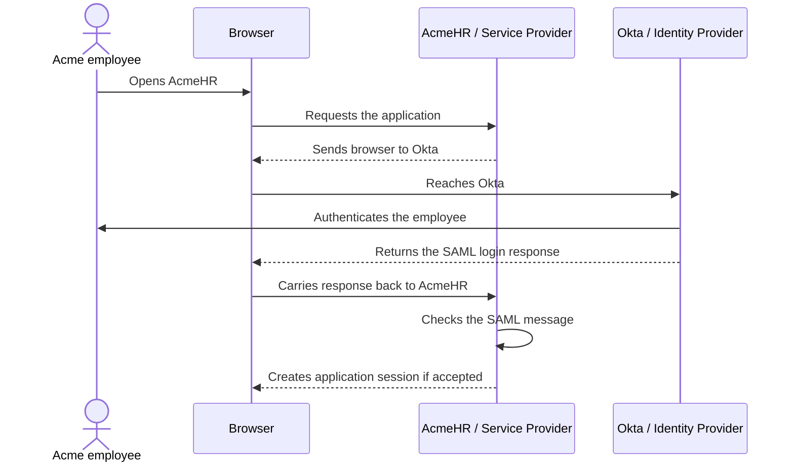
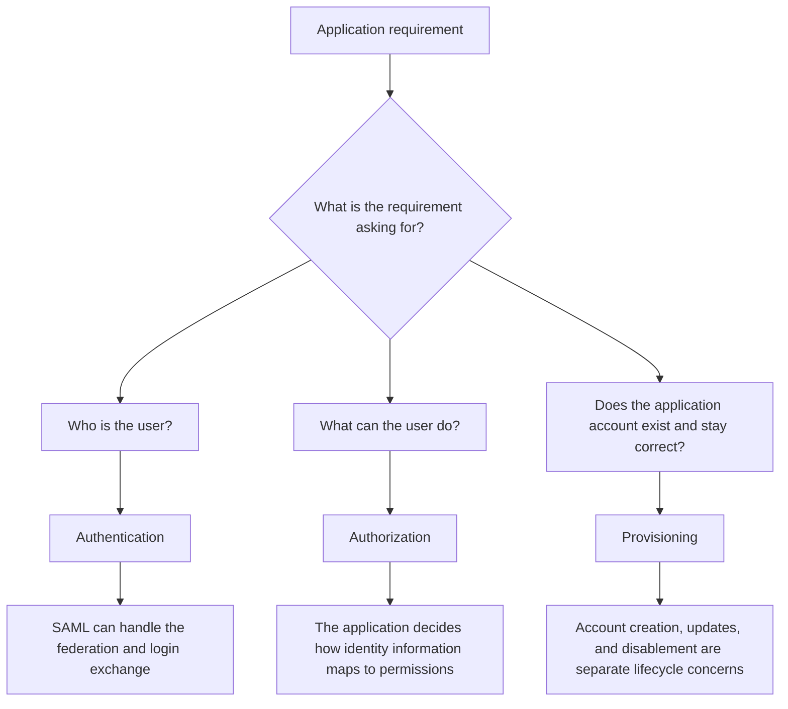
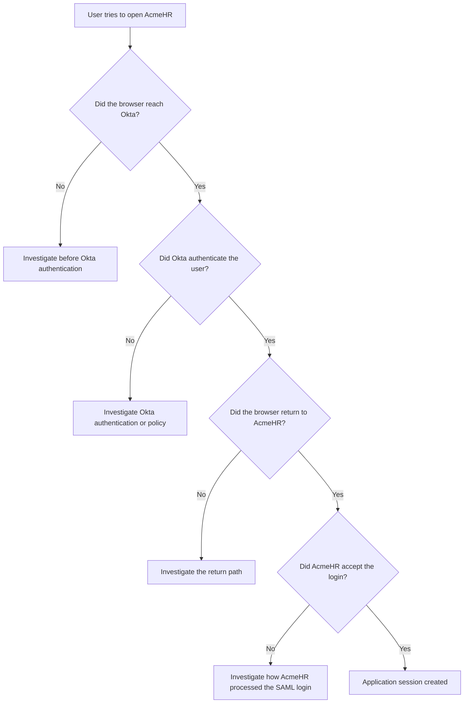

# Day 1 Diagrams

These diagrams support the Day 1 lesson and lab.

They are intentionally simple.

Day 1 is about understanding the people, systems, and responsibilities in a SAML project. It is not yet about XML fields, certificates, signatures, or detailed protocol validation.

---

## Diagram 1: Who talks to whom during the SAML login?

**Question answered:** Who is involved in the login, and what does each system do at a high level?



### What to notice

- The **user** is the employee trying to access AcmeHR.
- **Okta** is the Identity Provider because it authenticates the employee.
- **AcmeHR** is the Service Provider because it is the application the employee wants to access.
- The **browser** carries the user and SAML transaction between the two systems.
- Okta authentication is not the last step. AcmeHR still needs to accept the SAML message before the application session exists.

Do not worry yet about the exact contents of the SAML message.

Later lessons will open that message one piece at a time.

---

## Diagram 2: Authentication, authorization, and provisioning are different jobs

**Question answered:** Which part of the project is responsible for login, permissions, and account lifecycle?



### What to notice

A single application request can contain more than one type of work.

For example:

> Employees should sign in through Okta. New employees need an account before their first day. HR managers should see salary reports.

That contains three separate requirements:

```text
Sign in through Okta
        -> Authentication / federation

Account exists before first day
        -> Provisioning

HR managers see salary reports
        -> Authorization
```

Do not label the whole requirement as "SAML" just because SAML is used for the login.

---

## Diagram 3: First troubleshooting view

**Question answered:** Where should you start when someone says, "SAML login is broken"?



### The habit to keep

Do not start by guessing which setting is wrong.

Start with:

> **What is the last step I can prove succeeded?**

On Day 1, you are only locating the failure area.

Later lessons will teach you how to inspect the exact SAML fields and evidence inside each step.

---

## Day 1 diagram check

Before moving on, you should be able to look at these diagrams and explain:

1. why Okta is the IdP
2. why AcmeHR is the SP
3. what the browser does
4. why successful Okta authentication does not automatically mean the application login succeeded
5. why authentication, authorization, and provisioning must be treated as separate concerns
6. how to begin troubleshooting without guessing

If you can explain those points without reading the notes below the diagrams, the Day 1 diagrams have done their job.
