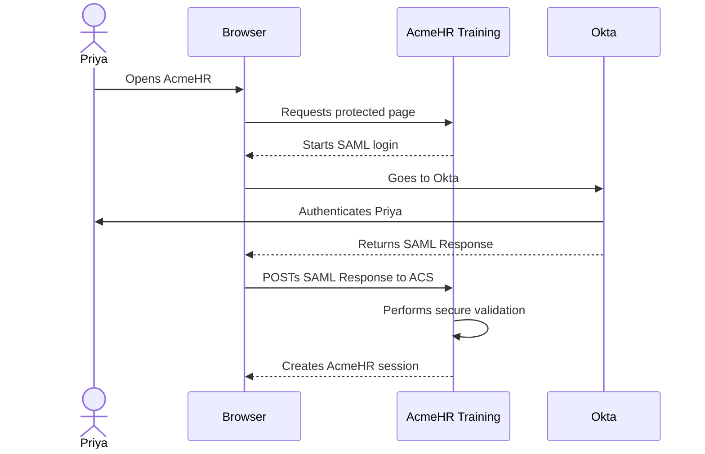

# Local Training Service Provider

## Why this exists

Starting on Day 3, the course needs a real Service Provider so the learner can run an actual SAML login with Okta.

This training SP represents **AcmeHR**.

Its job is not to act like a full production HR application.

Its job is to make the SAML transaction easy to see, test, break, troubleshoot, and understand.

The learner should be able to answer:

> What happened in the transaction?

without first needing to read application source code.

---

# The learner experience we want

The training SP should feel simple.

A fresher should be able to:

```text
Start the lab
    |
    v
Open AcmeHR
    |
    v
Click Sign in with Okta
    |
    v
Authenticate in Okta
    |
    v
Return to AcmeHR
    |
    v
See whether the login succeeded
```

Later lessons will expose more details from the same transaction.

The SP should grow with the course rather than being replaced by a different application every few days.

---

# What the training SP is responsible for

The SP must be able to:

- expose a protected AcmeHR page
- start SP-initiated SAML SSO
- generate an AuthnRequest
- send the browser toward Okta
- receive the SAML Response at its ACS endpoint
- validate the SAML login securely
- create its own application session after successful validation
- expose validated SAML claims for the Day 7 data-mapping lesson
- keep multi-valued group claims intact
- map only explicitly allowlisted group values to AcmeHR roles
- return an authorization denial without pretending authentication failed
- show learner-friendly transaction evidence
- support IdP-initiated SSO later in the course
- sign AuthnRequests for the request-signing lesson
- decrypt encrypted assertions for the encryption lesson
- expose metadata needed by Okta
- support controlled certificate rollover exercises
- support deliberate, reversible failures for troubleshooting labs

The implementation should stay small enough that the learner can understand what the application is doing.

---

# What the training SP must not do

The lab must not teach unsafe shortcuts.

The SP must not:

- disable signature validation to make a lab work
- accept assertions from any issuer
- skip Audience validation
- ignore endpoint checks
- ignore time conditions
- ignore request correlation where it applies
- accept unsigned messages when the configured security expectation requires signing
- silently accept decryption failures
- use hand-written XML signature verification
- expose private keys through the learner interface
- print session cookies as normal diagnostic output
- log passwords, MFA codes, or other authentication secrets
- depend on a public SAML decoder
- require the learner to modify library internals

If a lesson needs a failure, the failure should be created through controlled configuration, not by weakening the entire SAML implementation.

---

# Secure validation comes before teaching every validation field

On Day 3, the learner has not yet studied:

- signatures
- Audience
- Destination
- Recipient
- InResponseTo
- time conditions
- certificate ownership

The SP still needs to validate those correctly.

The learner does not need to understand every check on Day 3.

The interface can simply show that the secure validation completed successfully.

Later lessons will open each check one at a time.

This avoids teaching the dangerous idea that validation should be disabled until the learner understands it.

---

# Core training values

The training application should use stable values across the course wherever possible.

Planned baseline:

```text
Application name:
AcmeHR Training

Local base URL:
http://localhost:8000

ACS URL:
http://localhost:8000/saml/acs

SP Entity ID:
urn:acme:training:sp
```

These values should remain consistent unless a lesson deliberately changes one of them.

If we change a value for a break-and-fix exercise, the lab must tell the learner how to restore the baseline afterward.

---

# Learner-facing pages

The SP should have a very small number of pages.

## 1. Home page

Purpose:

> Give the learner one obvious place to start.

It should show:

- AcmeHR Training
- whether the user currently has an AcmeHR application session
- a **Sign in with Okta** action
- a link to the transaction view when a transaction exists

The page should not expose advanced SAML fields before their lesson.

---

## 2. Protected page

Purpose:

> Prove that AcmeHR created its own application session.

A successful Day 3 login should end here.

The page can show a simple message such as:

```text
Signed in to AcmeHR Training

Application session: Active
```

Later lessons may add carefully selected identity information.

Do not show every assertion attribute by default.

---

## 3. Transaction view

Purpose:

> Show what happened during the most recent SAML transaction.

This is the most important teaching page.

The amount of detail shown should depend on what the learner has already studied.

The page should support progressive disclosure.

---

## 4. Claims view

Current endpoint:

```text
/claims
```

Purpose:

> Show the identity data AcmeHR received from the already-validated SAML Assertion.

The page currently shows:

- authenticated principal
- email
- first name
- last name
- employee number
- department
- the complete groups collection
- mapped AcmeHR roles
- required claims that are missing

The page must not manually trust values copied from the raw browser POST.

It reads attributes from Spring Security's authenticated SAML assertion after validation has succeeded.

A missing required profile claim is shown as a data-contract problem. It does not automatically invalidate the already-established SAML authentication.

---

## 5. Manager authorization view

Current endpoint:

```text
/manager
```

Purpose:

> Prove that application authorization is a separate decision after authentication.

The current allowlist is intentionally small:

```text
AcmeHR-Managers
    ->
MANAGER
```

If the exact validated group value is present, the page returns:

```text
HTTP 200
Access granted
```

If the user is authenticated but the exact group is not present, the page returns:

```text
HTTP 403
Access denied
```

Case variants and unrelated group names do not grant the role.

The page therefore teaches:

```text
SAML authentication
    !=
application authorization
```

---

# Progressive disclosure

The SP knows more than the learner knows on Day 3.

That is fine.

The interface should not dump all internal details at once.

## Day 3 view

The learner should see only high-level stages such as:

```text
SAML login started             PASS

Browser returned to ACS        PASS

SAML validation                PASS

Application session created    PASS
```

That is enough to prove the first working SSO.

## Later lessons

As the learner reaches the relevant lesson, the interface can expose more detail.

Examples:

```text
AuthnRequest generated

Response received

Signature validation

Issuer validation

Audience validation

Destination validation

Recipient validation

InResponseTo validation

Time validation

NameID

Attributes

Groups

Mapped application roles

Application authorization

Application session
```

By Day 7, the learner can inspect validated claims through `/claims` and prove manager authorization through `/manager`.

The course should reveal each layer when it becomes teachable.

---

# Diagnostic status model

Every diagnostic stage should use a small, consistent vocabulary.

Prefer:

```text
PASS
FAIL
NOT CHECKED
NOT APPLICABLE
```

Avoid vague statuses such as:

```text
Maybe
Looks OK
Mostly valid
Probably fine
```

When a stage fails, the learner-facing message should explain the failure in plain language.

Example:

```text
Audience validation: FAIL

Plain meaning:
The SAML assertion was intended for a different
Service Provider identifier than this AcmeHR instance expects.
```

That detailed explanation should appear only after Audience has been taught.

---

# Evidence before diagnosis

The SP should support the troubleshooting method used throughout the course:

> **What is the last step I can prove succeeded?**

The transaction view should make it possible to answer that question.

For example:

```text
AuthnRequest generated         PASS
Browser reached Okta           PASS
Response received at ACS       PASS
Signature validation           PASS
Audience validation            FAIL
Application session            NOT CREATED
```

The learner can then identify:

```text
Last successful step:
Signature validation

First failed step:
Audience validation
```

The interface should support reasoning from evidence, not guessing.

---

# Raw message access

Later lessons need access to the real AuthnRequest and SAML Response.

The SP should therefore be able to retain the latest training transaction in memory or another simple local store.

The learner should eventually be able to inspect:

- encoded AuthnRequest
- decoded AuthnRequest XML
- encoded SAMLResponse
- decoded SAML Response XML
- selected validation results

Raw XML should not be shown by default on Day 3.

It should be exposed only when the lesson asks the learner to inspect it.

---

# Do not store unnecessary sensitive data

This is a training application, but good habits still matter.

The SP should avoid retaining more than is needed.

Do not persist:

- Okta passwords
- MFA codes
- Okta session cookies
- browser cookies from another system
- private keys in diagnostic output
- full production assertions
- unrelated identity data

The course should use dedicated training users and test data.

---

# Application session

The training SP must create its own local application session only after the SAML login has been accepted.

That is important for teaching this distinction:

```text
Okta session
    !=
AcmeHR application session
```

A successful Okta authentication must not automatically create the AcmeHR session unless the SAML transaction is accepted by the SP.

The UI should make the AcmeHR session state visible.

Day 7 adds another distinction:

```text
AcmeHR authenticated session
    !=
AcmeHR manager authorization
```

An authenticated user can receive HTTP 403 from `/manager` while keeping a valid AcmeHR application session.

That is an authorization denial, not an authentication failure.

---

# Logout

Basic local application logout should eventually be supported.

Later, when the course reaches SAML Single Logout, the SP can add SLO behavior if the selected library and Okta configuration support the required lab safely.

Day 3 does not need SLO.

Do not add SLO complexity to the first working login.

---

# SP-initiated SSO

Day 3 starts with SP-initiated SSO.

The expected high-level flow is:



The Day 3 lab needs only this successful path.

---

# IdP-initiated SSO

The SP should eventually support IdP-initiated SSO because the course compares SP-initiated and IdP-initiated behavior later.

Do not expose or teach it on Day 3.

The implementation should simply avoid making later IdP-initiated support impossible.

---

# SP metadata

The training SP should expose SAML metadata that contains the values Okta needs.

At minimum, the metadata should represent the SP configuration used by the lab.

The learner should eventually be able to see that metadata rather than treating the ACS and Entity ID as arbitrary strings.

Day 3 can still enter the values manually so the learner understands what they mean.

Later labs may use metadata more directly.

---

# IdP metadata

The training SP needs a safe way to load the Okta IdP configuration.

Preferred training workflow:

```text
Learner creates Okta SAML app
        |
        v
Learner obtains Okta Metadata URL
        |
        v
Learner provides Metadata URL to training SP
        |
        v
SP loads IdP configuration
```

The implementation must not require a production Okta API token just to configure basic SAML metadata.

The SAML relationship should work through standard federation information.

---

# Metadata retrieval behavior

If the SP loads metadata from a URL, the behavior should be clear and predictable.

The learner should be able to tell:

- which metadata URL is configured
- whether metadata loaded successfully
- when it was loaded
- whether a reload occurred

Do not silently change the IdP trust configuration in the background without telling the learner.

For later certificate-rollover lessons, metadata refresh behavior must be deliberate and observable.

---

# Configuration

Training configuration should be explicit and easy to reset.

A simple configuration model may include values such as:

```text
SP_BASE_URL
SP_ENTITY_ID
SP_ACS_URL
IDP_METADATA_URL
SESSION_SECRET
SAML_SIGN_REQUESTS
SAML_REQUIRE_SIGNED_RESPONSE
SAML_REQUIRE_SIGNED_ASSERTION
SAML_ENCRYPTION_ENABLED
```

These names are illustrative.

The final names will depend on the selected implementation.

The important requirement is that training settings are centralized and documented.

---

# Configuration must have a known baseline

Every lesson needs a known-good starting point.

The repository should define a baseline configuration for the working Day 3 flow.

Later labs can modify one controlled setting.

Example:

```text
Baseline
    |
    v
Change one setting
    |
    v
Observe one failure
    |
    v
Collect evidence
    |
    v
Restore baseline
```

The learner should never finish a lab with the shared training environment accidentally left broken.

---

# Deliberate failure controls

Later labs need realistic failures.

The SP should support controlled ways to create them.

Examples may include:

- wrong expected Audience
- wrong ACS-related configuration
- wrong trusted IdP certificate
- clock offset in the training environment
- request-signing mismatch
- encryption/decryption mismatch
- missing application-side user mapping
- session-creation failure after SAML validation

Each failure control must be:

- explicit
- reversible
- scoped to the training environment
- documented
- safe
- introduced only after the related concept is taught

Do not create a generic **Disable security** switch.

---

# Signing support

Later lessons require the SP to sign AuthnRequests.

Therefore the selected implementation must support:

- generating AuthnRequests
- signing AuthnRequests
- configuring the SP signing certificate and private key
- exposing the SP public certificate where appropriate
- allowing the learner to observe whether request signing is enabled

The SP private key must never be displayed in the learner UI.

---

# Encryption support

Later lessons require encrypted assertions.

Therefore the selected implementation must support:

- advertising or configuring an SP encryption certificate
- receiving encrypted SAML assertions
- decrypting them with the SP private key
- clearly reporting a decryption failure
- keeping the private decryption key protected

Signing and encryption must remain separate concepts in the implementation and UI.

---

# Certificate storage

Training certificates and keys should have a clear home under:

```text
lab-sp/certificates/
```

The repository may contain training-only certificates and keys generated specifically for this course if they are clearly marked as disposable lab material.

They must never be presented as suitable for production use.

If private lab keys are committed for reproducibility, the documentation must state clearly:

> These keys are public training material and must never be reused outside this lab.

A stronger design may generate disposable keys during lab setup.

The final approach will be chosen when the implementation is built.

---

# Library selection decision

The SAML implementation has now been selected.

Current Day 3 stack:

```text
Java 21
Spring Boot 4.1.1
Spring Security 7.1.1
spring-security-saml2-service-provider
OpenSAML 5 through Spring Security
```

The decision was made only after reviewing maintenance, current releases, security advisories, validation behavior, later signing and encryption needs, metadata support, and Docker compatibility.

The research and rationale are recorded in:

```text
lab-sp/library-selection.md
```

The dependency and advisory review must be repeated before later security-sensitive labs or any major version upgrade.

---

# Security rule for the SAML library

The library must perform the security-sensitive SAML processing.

We will not write our own code to implement:

- XML canonicalization
- XML Signature verification
- signature reference processing
- XML encryption processing
- protection against known XML signature confusion classes

Application code may organize the results and present learner-friendly diagnostics.

It must not replace the library's security validation with string matching or hand-written XML checks.

---

# Validation responsibilities

The final SP implementation must be able to enforce the validations required by the transaction and configuration.

That includes, as applicable:

- trusted IdP issuer
- XML signature
- expected Audience
- Destination
- Recipient
- time conditions
- request correlation / InResponseTo
- assertion decryption when encryption is enabled

The exact library API will determine how each result is surfaced.

The course must not claim that a validation occurred unless the implementation can prove it.

---

# Day 3 learner view versus internal validation

This distinction is central to the course.

## What the SP may internally validate on Day 3

```text
Signature
Issuer
Audience
Destination
Recipient
Time
Correlation
```

## What the learner needs to understand on Day 3

```text
SAML login started
Response returned
Secure validation passed
Application session created
```

Later lessons gradually replace:

```text
Secure validation passed
```

with the individual checks the learner now understands.

---

# Error messages

Raw library exceptions are useful to developers but often poor teaching material.

The SP should preserve technical detail for debugging while also producing a learner-friendly explanation.

Example:

```text
Technical result:
Audience validation failed

Learner explanation:
AcmeHR received the SAML login, but the assertion identifies
a different Service Provider than the one AcmeHR expects.
```

The learner-friendly explanation must not change the meaning of the technical result.

---

# Do not invent a diagnosis

If the library reports only:

```text
SAML processing failed
```

the UI must not invent:

```text
Certificate problem
```

without evidence.

When the exact failed validation is unknown, say that it is unknown and point to the available evidence.

---

# Transaction identifiers

The SP should give each training transaction a simple local identifier.

Example:

```text
Training transaction:
TX-000123
```

This is not a SAML protocol ID.

It is only a local lab identifier that helps the learner connect:

- browser evidence
- SP diagnostics
- logs
- later decoded messages

Do not confuse the local training transaction ID with AuthnRequest or Response IDs.

---

# Logging

Logs should be useful but controlled.

Useful log events may include:

- SP started
- metadata loaded
- login initiated
- AuthnRequest generated
- response reached ACS
- validation passed or failed
- application session created
- application session ended

Avoid logging full sensitive values by default.

Raw SAML messages may be stored only in the controlled training transaction view when the lesson requires them.

---

# Reset behavior

The learner needs an easy way to return to a known state.

The training SP should support a reset that clears:

- local application session
- latest training transaction evidence
- temporary failure toggles
- temporary lesson-specific settings

Reset must not silently replace the learner's Okta configuration.

If the learner changed Okta for a lab, the lab instructions must tell them how to restore that separately.

---

# Docker requirements

The training SP will be Dockerized.

The learner should not need to install:

- SAML libraries manually
- XML security libraries manually
- platform-specific cryptographic packages manually
- a local database just for the course

A normal start should eventually look like:

```text
docker compose up
```

or an equally simple documented command.

The exact command will be defined when the implementation exists.

---

# Docker goals

The container design should provide:

- repeatable runtime
- pinned application dependencies
- consistent port mapping
- predictable certificate paths
- simple environment-variable configuration
- clean startup logs
- health check
- easy reset
- no unnecessary services

Do not create a large infrastructure stack for a small teaching SP.

---

# Current repository layout

The training SP uses the standard Maven project structure:

```text
lab-sp/
├── README.md
├── library-selection.md
├── pom.xml
├── Dockerfile
├── compose.yml
└── src/
    ├── main/
    │   ├── java/
    │   │   └── com/acme/training/acmehr/
    │   │       ├── security/
    │   │       │   ├── SamlRelyingPartyConfig.java
    │   │       │   ├── SecurityConfig.java
    │   │       │   └── AcmeHrClaimMapper.java
    │   │       └── web/
    │   │           └── HomeController.java
    │   └── resources/
    │       └── templates/
    │           ├── home.html
    │           ├── protected.html
    │           ├── transaction.html
    │           ├── claims.html
    │           └── manager.html
    └── test/
        ├── java/
        └── resources/
```

Day 7 added the claim mapper and the `/claims` and `/manager` learner views.

Later certificate, diagnostic, and lesson-specific files should be added only when their purpose becomes necessary.

We do not need empty placeholder folders merely to make the repository look complete.

---

# Testing requirements

The training SP itself needs automated tests.

Current automated coverage includes:

- application starts
- metadata endpoint is available
- protected routes start the SAML flow
- generated AuthnRequest fields match the training configuration
- unsigned SAML content is rejected
- known-good signed SAML Response is accepted
- signed SAML that is changed after signing is rejected with `INVALID_SIGNATURE`
- the same signed SAML succeeds with the matching trusted IdP certificate
- the same signed SAML is rejected with `INVALID_SIGNATURE` when AcmeHR trusts a different certificate
- wrong issuer is rejected
- wrong Audience is rejected
- wrong Destination is rejected
- wrong Recipient is rejected
- wrong Response correlation is rejected
- wrong bearer-confirmation correlation is rejected
- not-yet-valid and expired assertion conditions are rejected
- expired bearer confirmation is rejected
- required Day 7 claims are read from the validated assertion
- multi-valued groups remain a collection
- only the exact `AcmeHR-Managers` value maps to `MANAGER`
- unrelated and differently cased groups do not receive `MANAGER`
- missing required claims are reported without pretending authentication failed
- `/claims` renders the validated claim evidence
- `/manager` returns HTTP 200 for a mapped manager
- `/manager` returns HTTP 403 for an authenticated non-manager
- unauthenticated `/claims` and `/manager` requests start SAML login
- optional SP request-signing and decryption credentials load from external resource locations
- incomplete SP credential pairs are rejected
- signing credentials require an explicit NameID format
- Day 8 no-SP-key behavior remains unchanged when Day 9 credentials are omitted
- generated Day 9 Redirect AuthnRequest contains `SAMLRequest`, `RelayState`, `SigAlg`, and `Signature`
- the actual Redirect-binding signature verifies with the matching AcmeHR public certificate
- the same signed Redirect does not verify with a different certificate
- generated Day 9 AuthnRequest contains `NameIDPolicy`
- SP metadata publishes signing and encryption public-key descriptors
- SP metadata contains no private-key material
- encrypted Assertion decrypts with the matching AcmeHR private key
- the same encrypted Assertion is rejected with `DECRYPTION_ERROR` when a different private key is used
- Docker Compose test profile builds and runs
- training SP container builds and passes its startup smoke test

Later security-sensitive lessons still need focused coverage for certificate rollover, IdP-initiated behavior, and logout. Day 8 response-signature integrity and IdP verification-trust failures are covered. Day 9 request signing, SP metadata key publication, and encrypted-Assertion decryption failures are now covered.

---

# Course quality requirement

A lab is not complete just because the browser eventually reaches a success page.

For every feature added to the SP, we should ask:

```text
Is it technically correct?

Is it secure?

Can a fresher understand what happened?

Can we prove the result?

Can we deliberately break it later?

Can we restore it?

Does it support the next lessons without exposing concepts too early?
```

If the answer to one of those is no, the feature is not ready.

---

# Day 3 minimum implementation

The first implementation does **not** need every future feature.

For the Day 3 lab, the minimum useful SP needs:

- local AcmeHR home page
- protected page
- SP-initiated SAML login
- stable SP Entity ID
- stable ACS URL
- SP metadata
- Okta IdP metadata configuration
- secure SAML Response processing
- local application session
- simple Day 3 transaction summary using PASS and NOT CHECKED
- Dockerized startup
- known reset procedure

That is enough to create the first working end-to-end transaction.

Day 3 does not invent a FAIL status when the application has no stored evidence for a specific failed stage. Explicit FAIL states are added later only when the SP captures evidence that a particular validation or processing stage failed.

---

# Features deliberately deferred

Do not add these to the Day 3 learner workflow yet:

- detailed AuthnRequest inspection
- detailed Response/Assertion inspection
- claims editor
- group mapping UI
- request-signing controls
- encryption controls
- certificate rollover controls
- IdP-initiated controls
- SLO controls
- blind incident toggles

Those features belong to later lessons.

The implementation may be designed so they can be added cleanly later.

---

# Build order

The SP should be built in small reviewed pieces.

Planned sequence:

```text
1. Define SP requirements
      |
      v
2. Research and select SAML library
      |
      v
3. Pin runtime and dependencies
      |
      v
4. Build minimal Dockerized SP
      |
      v
5. Add secure Okta SAML configuration
      |
      v
6. Prove one working SP-initiated login
      |
      v
7. Add learner-facing transaction evidence
      |
      v
8. Pressure-test security and failure handling
      |
      v
9. Only then finalize Day 3 lab
```

We will not jump directly to a large application implementation.

---

# Day 3 readiness

Repository readiness and a learner's live Okta transaction are two different proofs.

## Proven automatically in the repository

```text
[x] Maven build and tests pass

[x] Docker image builds

[x] Container starts cleanly

[x] Health endpoint reports UP

[x] AcmeHR home page loads

[x] SP Entity ID is urn:acme:training:sp

[x] ACS is http://localhost:8000/saml/acs

[x] SP metadata publishes the expected Entity ID and ACS

[x] IdP metadata can be loaded into the relying-party configuration

[x] Requesting the protected AcmeHR page starts the SAML flow

[x] An unsigned SAML response is rejected

[x] Rejected SAML does not create an authenticated session

[x] No SAML security validation is disabled

[x] The learner-facing home, protected, and transaction views are present

[x] docker compose down returns the local runtime to a fresh container state
```

These checks are enforced by the training SP test suite and GitHub Actions workflow.

## Proven during the learner's Day 3 Okta lab

A repository test cannot impersonate the learner's real Okta org. The live lab therefore proves the external part of the transaction:

```text
[ ] Browser reaches the learner's Okta org

[ ] The assigned test user authenticates

[ ] Okta returns the browser to /saml/acs

[ ] AcmeHR accepts the real Okta SAML response

[ ] AcmeHR creates its authenticated application session

[ ] The protected page opens

[ ] The transaction view shows the successful Day 3 baseline
```

The learner should not continue to Day 4 until those live checks pass.

---

# Day 7 implementation status

The repository now contains the application-side pieces needed by the Day 7 claims and authorization lab.

## Proven automatically

```text
[x] /claims requires authentication

[x] /manager requires authentication

[x] Validated SAML attributes are read through Spring Security 7.1 assertion accessors

[x] email, firstName, lastName, employeeNumber, and department are treated as required AcmeHR profile claims

[x] groups remains multi-valued

[x] AcmeHR-Managers maps to MANAGER

[x] Unrelated groups do not become application roles

[x] Group-name matching is exact and case-sensitive

[x] Missing required claims remain visible after successful authentication

[x] /claims renders the validated claim data

[x] /manager returns HTTP 200 for a mapped manager

[x] /manager returns HTTP 403 for an authenticated user without MANAGER

[x] Unauthenticated /claims and /manager requests start SAML login
```

## Proven during the learner's live Day 7 Okta lab

```text
[ ] Okta sends the configured profile claims

[ ] Okta sends the selected AcmeHR group values

[ ] The live AttributeStatement matches the claim contract

[ ] The /claims page matches the live Assertion

[ ] AcmeHR-Managers produces MANAGER

[ ] /manager is allowed for the manager baseline

[ ] Wrong employeeNumber claim name is isolated and restored

[ ] Missing department is observed and restored

[ ] Wrong group filter removes manager authorization while authentication still succeeds

[ ] The known-good Day 7 state is restored
```

Repository tests prove the application behavior.

The live lab proves the learner's Okta tenant is sending the expected claims.

---

# Day 8 implementation status

The repository now contains the focused signature-validation tests needed by the Day 8 signing and IdP-certificate lab.

Day 8 keeps the learner's live Okta signing certificate unchanged for failure testing. Certificate rollover remains a later operational exercise.

`SamlSignatureValidationTests.java` contains a certificate and private key committed deliberately as a reproducible synthetic fixture. That private key is public training material, provides no secrecy, and must never be reused for a real application, tenant, environment, or certificate.

## Proven automatically

```text
[x] A known-good signed SAML Response authenticates with the matching trusted verification certificate

[x] Unsigned SAML does not create an authenticated session

[x] Signed XML changed after signing is rejected with INVALID_SIGNATURE

[x] The tampered test changes the signed content without re-signing it

[x] The same signed SAML is accepted with the matching trusted certificate

[x] The same signed SAML is rejected with INVALID_SIGNATURE when AcmeHR trusts a different certificate

[x] The wrong-certificate test changes verification trust without changing the signed SAML

[x] Spring Security and OpenSAML perform the cryptographic verification

[x] The committed Day 8 signing key is clearly marked as public disposable test material

[x] No hand-written XML signature verifier is used

[x] Day 8 negative tests run through the existing Maven and Docker validation-test workflow
```

The focused Day 8 tests are:

```text
SamlResponseRejectionTests
    unsignedSamlResponseDoesNotCreateAuthenticatedSession

SamlSignatureValidationTests
    tamperedSignedResponseIsRejectedAsInvalidSignature

    responseSignedByCertificateThatAcmeHrDoesNotTrustIsRejected
```

These tests isolate three different trust outcomes:

```text
No required signature protection
    -> rejected

Signed content changed after signing
    -> INVALID_SIGNATURE

Signed content unchanged, wrong trusted verification certificate
    -> INVALID_SIGNATURE
```

The last two produce the same signature-layer error while having different root causes.

That distinction is intentional.

## Proven during the learner's live Day 8 Okta lab

```text
[ ] The learner records the original Response and Assertion signing settings

[ ] The active Okta SAML signing certificate is identified without rotating it

[ ] IdP metadata verification-certificate fingerprints are recorded locally

[ ] A fresh live SAMLResponse is captured and decoded locally

[ ] The signed object is identified from ds:Signature location and Reference URI

[ ] SignatureMethod and DigestMethod are recorded from the live XML

[ ] Embedded KeyInfo certificate material, when present, is treated as evidence rather than automatic trust

[ ] A both-signed Okta transaction is accepted

[ ] An Assertion-only signed transaction is accepted by this training SP

[ ] A Response-only signed transaction is accepted by this training SP

[ ] The learner runs the unsigned-SAML rejection test

[ ] The learner runs the tampered-signature test

[ ] The learner runs the wrong-trusted-certificate test

[ ] The original Okta signing settings are restored

[ ] The restored live SAML baseline is proven again
```

Repository tests prove the local Service Provider's signature-enforcement behavior.

The live lab proves the learner can connect Okta signing configuration, certificate evidence, SAML XML, and AcmeHR acceptance without weakening validation or rotating the live certificate.

---

# Day 9 implementation status

The repository now contains the application-side and focused test coverage needed for the Day 9 request-signing and Assertion-encryption lab.

Day 9 keeps real SP private keys outside the repository. The committed key material used by the focused tests is disposable public training material and must never be reused in a real application, tenant, or environment.

## Day 9 configuration

`SamlRelyingPartyConfig.java` now supports optional SP-owned credentials through external resource locations:

~~~text
acmehr.saml.sp-signing-private-key-location
acmehr.saml.sp-signing-certificate-location

acmehr.saml.sp-decryption-private-key-location
acmehr.saml.sp-decryption-certificate-location

acmehr.saml.name-id-format
~~~

When Day 9 credentials are omitted, the earlier no-SP-key baseline remains unchanged.

When a signing credential is configured:

~~~text
private signing key + X.509 certificate
        |
        v
signingX509Credentials
        |
        v
authnRequestsSigned(true)
        |
        v
explicit NameID format required
~~~

The decryption credential is configured independently through `decryptionX509Credentials`.

The configuration rejects a half-configured key pair instead of silently continuing with only a certificate or only a private key.

## Proven automatically

~~~text
[x] No Day 9 credentials preserves the earlier unsigned-AuthnRequest baseline

[x] SP signing and decryption credentials load from external resource locations

[x] AuthnRequest signing is forced when the SP signing credential is configured

[x] NameID format is required when request signing is configured

[x] An incomplete signing key/certificate pair is rejected

[x] The generated AuthnRequest still uses HTTP-Redirect

[x] The generated Redirect contains SAMLRequest, RelayState, SigAlg, and Signature

[x] SigAlg is RSA-SHA256 in the focused training fixture

[x] The actual Redirect-binding signature verifies with the matching AcmeHR public certificate

[x] The same exact signed Redirect does not verify with a different public certificate

[x] The wrong-certificate test changes only the verification certificate

[x] The decoded AuthnRequest contains NameIDPolicy

[x] The decoded Redirect AuthnRequest does not need an embedded ds:Signature

[x] Issuer, Destination, ACS, and HTTP-POST response binding remain correct

[x] SP metadata publishes a signing KeyDescriptor with the configured public certificate

[x] SP metadata publishes an encryption KeyDescriptor with the configured public certificate

[x] SP metadata does not publish private-key material

[x] EncryptedAssertion is present in the focused encrypted Response fixture

[x] The plaintext Assertion element is not present in that serialized encrypted fixture

[x] EncryptedAssertion decrypts with the matching AcmeHR private key

[x] The matching-key path continues through normal SAML validation and creates an authenticated principal

[x] The same encrypted SAML is rejected with DECRYPTION_ERROR when AcmeHR uses a different private key

[x] The wrong-decryption-key test first proves the exact fixture succeeds with the matching key

[x] Spring Security / OpenSAML perform the application SAML processing

[x] No production private key is committed by the Day 9 implementation
~~~

The focused Day 9 tests are:

~~~text
SamlRelyingPartyConfigTests
    loadsAcmeHrRelyingPartyFromTestMetadataWithoutDay9Credentials
    loadsDay9SigningAndDecryptionCredentials
    requiresNameIdFormatWhenSigningCredentialIsConfigured
    rejectsIncompleteSigningCredentialPair

SamlAuthenticationRequestTests
    spInitiatedLoginCreatesSignedDay9RedirectBindingAuthnRequest
    signedRedirectRequestDoesNotVerifyWithDifferentCertificate

SamlServiceProviderMetadataTests
    publishedMetadataAdvertisesExpectedEntityIdAcsAndDay9PublicKeys

SamlEncryptedAssertionTests
    encryptedAssertionDecryptsWithMatchingAcmeHrPrivateKey
    encryptedAssertionIsRejectedWithDifferentPrivateKey
~~~

These tests isolate the Day 9 failure directions:

~~~text
AcmeHR -> Okta

same signed Redirect
matching AcmeHR verification certificate
    -> verifies

same signed Redirect
different verification certificate
    -> does not verify
~~~

and:

~~~text
Okta -> AcmeHR

same encrypted SAML
matching AcmeHR private decryption key
    -> authenticates

same encrypted SAML
different private decryption key
    -> DECRYPTION_ERROR
~~~

## Spring Security 7.1.1 encrypted-Assertion boundary

The focused decryption fixture deliberately uses:

~~~text
signed outer Response
+
encrypted Assertion
~~~

It does not use a signed inner Assertion as the primary Day 9 decryption proof.

The repository library review tracks Spring Security issue #19606 for the pinned Spring Security 7.1.1 / OpenSAML 5 stack. The issue is currently open and describes namespace movement during encrypted-Assertion processing that can change the canonicalized inner Assertion and cause its signature digest to fail.

Do not work around that behavior by disabling signature validation, accepting unsigned SAML, or adding custom XML Signature verification.

Recheck the upstream issue or move to a fixed supported version before relying on a signed inner Assertion as the primary encrypted-Assertion fixture.

Issue:

https://github.com/spring-projects/spring-security/issues/19606

## Proven during the learner's live Day 9 Okta lab

~~~text
[ ] The learner records the original Okta Signed Requests and Assertion Encryption settings

[ ] The AcmeHR request-signing public certificate fingerprint is identified

[ ] The AcmeHR encryption public certificate fingerprint is identified

[ ] SP metadata signing and encryption KeyDescriptor values are inspected

[ ] Only public certificate material is exchanged with Okta

[ ] NameIDPolicy is proven before Signed Requests is enabled

[ ] Okta Signature Certificate matches the AcmeHR request-signing key pair

[ ] A fresh Redirect contains SAMLRequest, RelayState, SigAlg, and Signature

[ ] The signed Redirect is accepted by Okta and the login flow continues

[ ] Okta Encryption Certificate matches the AcmeHR decryption key pair

[ ] The learner records the configured Encryption Algorithm

[ ] The learner records the configured Key Transport Algorithm

[ ] A fresh live SAMLResponse contains EncryptedAssertion

[ ] Base64 decoding does not reveal the encrypted Assertion plaintext

[ ] AcmeHR decrypts the live Assertion and creates the authenticated application session

[ ] The learner runs SamlAuthenticationRequestTests

[ ] The learner runs SamlEncryptedAssertionTests

[ ] The learner can explain the wrong request-verification-certificate failure

[ ] The learner can explain the wrong decryption-key failure

[ ] No AcmeHR private key is uploaded to Okta

[ ] The intended Day 9 baseline is confirmed or restored
~~~

Repository tests prove the local request-signing, metadata-publication, and Assertion-decryption behavior.

The live lab proves that the learner can connect those local guarantees to the real Okta Signature Certificate, Signed Requests, Encryption Certificate, Assertion Encryption, and browser transaction without deliberately breaking the live certificate relationships.

---

# The standard

The training SP should feel like:

> **A small real application that makes SAML behavior visible.**

It should not feel like:

> **A protocol simulator that accepts anything just to make screenshots look successful.**

The goal is to teach the learner how a real Service Provider behaves while keeping the interface simple enough to understand one concept at a time.
