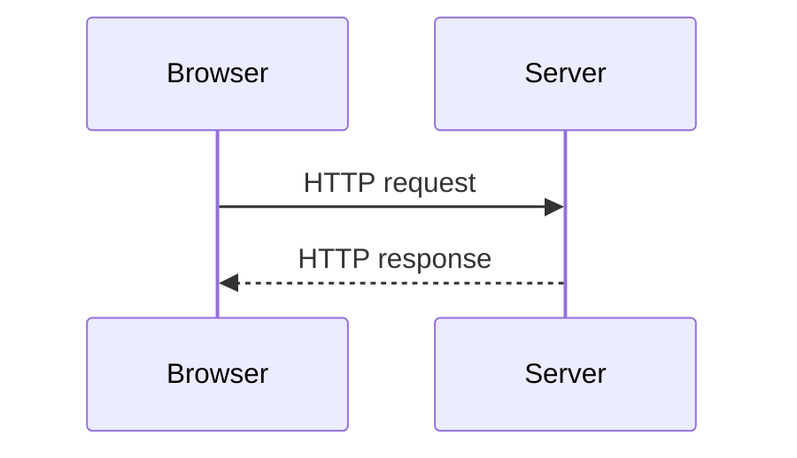
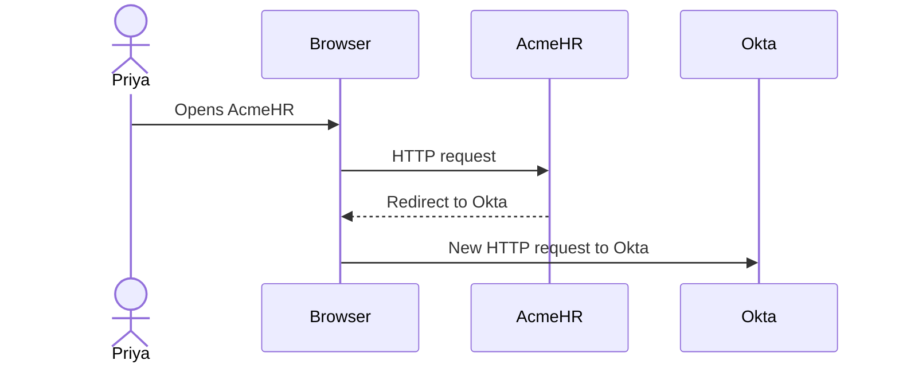
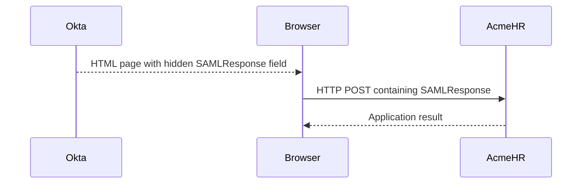
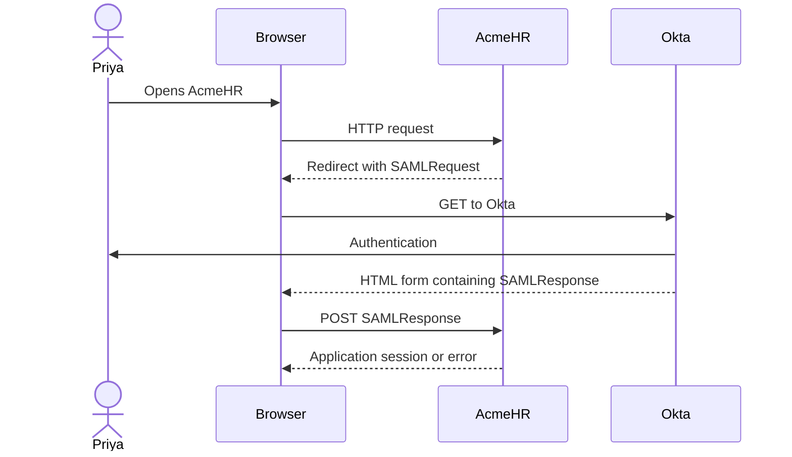
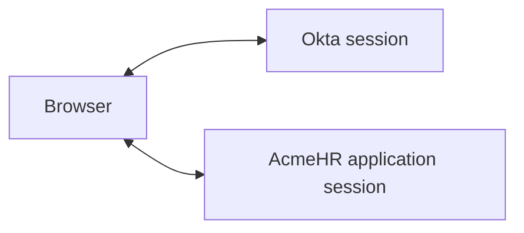

# Day 2: HTTP and Browser Foundations

## What you should understand by the end of today

On Day 1, you learned who is involved in the SAML login.

Today we will look at **how the browser actually carries the transaction between AcmeHR and Okta**.

By the end of Day 2, you should be able to explain:

- what an HTTP request is
- what an HTTP response is
- what GET and POST mean at a practical level
- what a browser redirect does
- what query parameters are
- why URL encoding exists
- what a form POST looks like
- what browser cookies and sessions do
- what common HTTP status codes tell you
- what "front-channel" means in this SAML flow
- what Base64 does and does not do
- why a SAMLRequest and a SAMLResponse are commonly encoded differently
- where to look in browser Developer Tools when tracing a login

You still do not need to understand the internal SAML XML fields.

Today is about **transport**.

---

## Start with the problem

On Day 1, we simplified the login like this:

```text
AcmeHR
   |
   | sends the browser to Okta
   v
Okta
   |
   | authenticates the user
   v
Browser
   |
   | carries the SAML login response
   v
AcmeHR
```

That is useful, but an engineer eventually needs to answer:

> What does "sends the browser" actually mean?

and:

> How does the SAML message get from one system to the other?

That is what HTTP and the browser are doing for us.

---

# 1. What HTTP is doing

When your browser talks to a website, it usually sends an **HTTP request**.

The server sends back an **HTTP response**.

Keep the idea simple:

```text
Browser
   |
   | HTTP request
   v
Server
   |
   | HTTP response
   v
Browser
```

For example, when Priya opens:

```text
https://acmehr.example.com/
```

her browser sends a request to AcmeHR.

AcmeHR then decides what response to send back.

That response might be:

- the application page
- a redirect somewhere else
- an error
- an HTML page containing a form

SAML browser SSO uses these normal browser and HTTP behaviors.

It is not using a special transport that exists only for SAML.

---

## Request and response in plain language

Think of the request as:

> Browser: "I want this resource."

The response is:

> Server: "Here is the result."

The result may contain content, instructions, or an error.

That request-and-response pattern repeats many times during a login.

---

## Diagram: one browser request

**Question answered:** What happens when a browser asks a server for something?



This simple pattern is underneath the SAML browser flow.

---

# 2. What is a URL?

A **URL** is an address the browser uses to locate something.

Example:

```text
https://acmehr.example.com/login
```

At a beginner level, notice these pieces:

```text
https://        acmehr.example.com        /login
   |                    |                    |
 scheme                host                 path
```

You do not need to memorize networking terminology today.

You only need to understand that different URLs point the browser to different locations.

During SAML SSO, the browser moves between URLs belonging to the SP and the IdP.

---

# 3. GET: asking for something through the URL

An HTTP **GET** request is commonly used when the browser is asking a server for a resource.

For example:

```text
GET /login
```

At a practical level:

> The browser is asking for the login resource.

A GET request can also carry values in the URL.

Example:

```text
https://example.com/search?department=HR
```

The part after the question mark is a **query string**.

Inside it:

```text
department=HR
```

is a **query parameter**.

---

## Why query parameters matter for SAML

In a common SP-initiated SAML flow, the browser may be redirected to Okta with values in the URL.

One of those values can be:

```text
SAMLRequest=...
```

Another may be:

```text
RelayState=...
```

Do not try to understand the inside of those values yet.

For Day 2, the important idea is:

> A browser redirect can carry information in the URL as query parameters.

We will study the actual AuthnRequest later.

---

# 4. What is a redirect?

A redirect means:

> The server tells the browser to go to another URL.

For example:

1. Priya opens AcmeHR.
2. AcmeHR decides that Priya should authenticate through Okta.
3. AcmeHR sends a redirect response.
4. Priya's browser follows the new URL and reaches Okta.

The browser is doing the moving.

---

## Diagram: browser redirect from AcmeHR to Okta

**Question answered:** What does it mean when we say AcmeHR "sends the user to Okta"?



AcmeHR is not physically transferring the browser connection to Okta.

AcmeHR sends a response that tells the browser where to go next.

The browser then makes a new request to Okta.

---

## Common redirect status codes

You may see HTTP status codes such as:

```text
302 Found
303 See Other
307 Temporary Redirect
308 Permanent Redirect
```

For this course, you do not need to memorize every difference yet.

The important troubleshooting idea is:

> A 3xx response often means the browser is being told to go somewhere else.

When tracing SSO, the response's **Location** value shows the next URL.

---

# 5. POST: sending data in the request body

An HTTP **POST** request commonly sends data to a server in the request body rather than placing the main value in the URL.

For a normal SAML browser flow, the SAML Response is commonly returned to the application using an HTML form POST.

At a high level:

```text
Browser
   |
   | HTTP POST
   | SAMLResponse=...
   v
AcmeHR
```

The browser submits the value to the application.

---

## GET and POST are not "read" and "write" shortcuts

You may hear simplified explanations like:

> GET reads. POST writes.

That is too simplistic for troubleshooting SAML.

For our course, use this practical distinction:

```text
GET
Often carries request information in the URL.

POST
Can carry form data in the request body.
```

The exact behavior depends on the application and protocol.

---

# 6. What is a form POST?

A browser can receive an HTML page containing a form.

That form can contain hidden fields.

For example:

```html
<form method="post" action="https://acmehr.example.com/sso">
    <input type="hidden" name="SAMLResponse" value="..." />
</form>
```

You are not expected to memorize HTML.

Look at only three things:

```text
method="post"
    -> the browser will send an HTTP POST

action="https://acmehr.example.com/sso"
    -> this is where the browser will send it

name="SAMLResponse"
    -> one form field carries the SAML Response
```

In real SAML SSO, the page is commonly designed to submit the form automatically.

That is why the user often does not see or click a form.

---

## Diagram: Okta returns a SAML Response through the browser

**Question answered:** How does the SAML Response commonly get from Okta back to the application?



The important point is:

> Okta gives the browser a page that contains the SAML Response, and the browser POSTs that value to AcmeHR.

We will learn the destination endpoint in more detail on Day 3.

---

# 7. The browser is carrying the SAML transaction

Now we can make the Day 1 flow more concrete.

**Question answered:** Which HTTP behavior is commonly used in each direction?



A common practical pattern is:

```text
SP -> Okta
SAMLRequest
HTTP-Redirect binding

Okta -> SP
SAMLResponse
HTTP-POST binding
```

This is common, not universal.

Do not assume every integration uses exactly the same bindings.

---

# 8. What does "binding" mean?

In SAML, a **binding** describes how a SAML protocol message is carried using another protocol such as HTTP.

For now, you only need two:

### HTTP-Redirect binding

The SAML message is carried through a browser redirect, commonly in the URL.

Typical example in our course:

```text
AuthnRequest -> HTTP-Redirect
```

### HTTP-POST binding

The SAML message is carried in an HTML form that the browser POSTs.

Typical example in our course:

```text
SAMLResponse -> HTTP-POST
```

That is enough binding knowledge for today.

---

# 9. Why URL encoding exists

URLs cannot safely carry every character exactly as-is.

Some characters have special meaning in a URL.

So values placed into a URL may be **URL-encoded**.

For example, a space may appear as:

```text
%20
```

Other characters may also be represented using percent-encoded values.

This matters because a SAMLRequest carried in a redirect has gone through several steps before you see it in the browser URL.

You should not look at the encoded value and expect it to resemble readable XML.

---

# 10. Base64 is not encryption

This distinction is important enough to learn now.

**Base64** converts binary or text data into a text representation that is easier to transport.

It does **not** make the data secret.

Example:

```text
Hello
```

can be represented in Base64 as:

```text
SGVsbG8=
```

Anyone who knows it is Base64 can decode it.

There is no secret key.

So:

```text
Base64 != encryption
```

If you can decode the value without a key, it was not made confidential by Base64.

---

## Why SAML uses Base64

SAML messages are XML.

Browser transports such as URLs and HTML form fields need a safe way to carry the message as text.

Base64 is part of that transport process.

Again:

> Encoding changes representation. Encryption is meant to protect confidentiality.

Those are different jobs.

---

# 11. Why SAMLRequest and SAMLResponse commonly decode differently

This is one of the most useful Day 2 concepts.

A common SAMLRequest sent using **HTTP-Redirect binding** goes through this process:

```text
SAMLRequest XML
      |
      v
DEFLATE compression
      |
      v
Base64 encoding
      |
      v
URL encoding
      |
      v
Placed in redirect URL
```

A common SAMLResponse sent using **HTTP-POST binding** goes through a different process:

```text
SAMLResponse XML
      |
      v
Base64 encoding
      |
      v
Placed in hidden HTML form field
      |
      v
Browser POSTs the form
```

The POST binding does not use the same DEFLATE step used by the Redirect binding.

That difference matters when decoding.

---

## What is DEFLATE?

**DEFLATE** is a compression method.

Its job here is to make the Redirect-binding message smaller before it is encoded and placed into the URL.

Do not confuse compression with encryption.

```text
Compression
    -> makes data smaller

Encoding
    -> changes how data is represented

Encryption
    -> protects confidentiality using cryptography
```

Three different jobs.

---

# 12. The decoding order matters

Imagine you capture this:

```text
SAMLRequest=...
```

from a redirect URL.

To get back to the XML, the normal process is the reverse of how it was prepared:

```text
URL-encoded SAMLRequest
        |
        v
URL decode
        |
        v
Base64 decode
        |
        v
DEFLATE decompress
        |
        v
SAML XML
```

For a SAMLResponse from a normal POST form:

```text
Base64 SAMLResponse
        |
        v
Base64 decode
        |
        v
SAML XML
```

This is why one generic "Base64 decode everything" helper can work for a POST response but fail on a Redirect request.

The transport matters.

---

# 13. What is front-channel communication?

You will hear the term **front channel** in SAML.

For this course, use this simple meaning:

> The browser is involved in carrying the message between the systems.

Our common flow is front-channel:

```text
AcmeHR -> Browser -> Okta

Okta -> Browser -> AcmeHR
```

The browser participates in the transaction.

This is different from two servers making a direct backend call to each other.

---

## Why this matters for troubleshooting

If the browser carries the transaction, the browser gives you valuable evidence.

You can inspect:

- where it went
- which URLs were requested
- which redirects occurred
- whether a POST happened
- which HTTP status code came back
- whether the browser reached Okta
- whether it returned to the application

That is why browser tracing is one of the first troubleshooting tools for SAML.

---

# 14. Cookies and browser sessions

A **cookie** is a small value that a website can ask the browser to store and send back on later requests to that same site.

Cookies are commonly used to help a site remember that the browser already has a session.

For example:

```text
Browser <-> Okta
```

may have an Okta session cookie.

And separately:

```text
Browser <-> AcmeHR
```

may have an AcmeHR application session cookie.

These are not automatically the same session.

---

## Diagram: separate sessions

**Question answered:** Why can the user still have an application session even though Okta is a separate system?



The browser can have a relationship with both systems at the same time.

We will study session behavior in more depth later.

For now, remember:

> An Okta session and an AcmeHR session are separate states.

---

## Do not share session cookies

A session cookie may allow access to an active signed-in session.

Do not paste active session cookies into tickets, chat tools, screenshots, or public troubleshooting sites.

When gathering evidence, capture only what you actually need.

---

# 15. HTTP status codes as troubleshooting clues

An HTTP status code tells you the general result of an HTTP response.

You do not need to memorize the entire list.

Start with these groups:

```text
2xx
Request was successfully handled.

3xx
The browser is being redirected.

4xx
The request has a client-side or request-related problem.

5xx
The server encountered a problem while handling the request.
```

Common examples:

```text
200 OK
The server returned a successful response.

302 Found
Common redirect response.

400 Bad Request
The server rejected the request as invalid.

401 Unauthorized
Authentication is required or was not accepted.

403 Forbidden
The server understood the request but is refusing access.

404 Not Found
The requested resource was not found.

500 Internal Server Error
The server failed while processing the request.
```

Do not diagnose SAML only from the number.

Use the status code as one piece of evidence.

---

# 16. Browser Developer Tools

Modern browsers include Developer Tools.

For SAML troubleshooting, the **Network** view is especially useful.

It lets you see browser requests and responses.

You can usually inspect information such as:

- request URL
- request method
- query parameters
- status code
- response headers
- redirect location
- form data
- request timing

The exact layout varies by browser.

The goal is not to memorize where every button is.

The goal is to understand what evidence you are looking for.

---

## A simple tracing habit

Before reproducing the login:

1. open Developer Tools
2. open the Network view
3. clear older requests
4. reproduce the login
5. follow the transaction in order

Ask:

```text
What URL did the browser request?

What HTTP method was used?

Did a redirect occur?

Where did the redirect point?

Did the browser reach Okta?

After authentication, did the browser POST back toward AcmeHR?

What status code came back?
```

This is already enough to locate many failures at a high level.

---

# 17. A browser trace is evidence, not the answer

Suppose the browser trace shows:

```text
1. Request to AcmeHR
2. Redirect to Okta
3. Okta authentication
4. POST back to AcmeHR
5. AcmeHR returns an error
```

What can you prove?

You can prove:

- the browser reached AcmeHR
- AcmeHR redirected toward Okta
- the browser reached Okta
- the browser returned toward AcmeHR after authentication

What can you **not** prove yet?

You cannot prove from that timeline alone:

- that the SAML signature was accepted
- that the application accepted the SAML message
- that user attributes were correct
- that an application account existed

Those are later layers.

The trace tells you where to look next.

---

# 18. The successful transport path before troubleshooting failures

Before troubleshooting, make sure the normal transport makes sense.

```text
1. Browser requests AcmeHR.

2. AcmeHR returns a redirect.

3. Browser follows the redirect to Okta.

4. Okta authenticates the user.

5. Okta returns a page containing a SAMLResponse.

6. Browser POSTs the SAMLResponse to AcmeHR.

7. AcmeHR processes the login.

8. Browser receives the application result.
```

If you understand those eight steps, browser troubleshooting becomes much easier.

---

# 19. First transport-focused troubleshooting examples

## Example 1: browser never reaches Okta

You open AcmeHR.

The browser stays on AcmeHR and returns an application error.

What can you say?

> The failure happened before you could prove that the browser reached Okta.

Do not start investigating a SAML Response that never existed.

---

## Example 2: browser reaches Okta but does not return

The browser reaches Okta and authentication succeeds.

You never see a POST back toward AcmeHR.

What can you say?

> Okta authentication succeeded, but you have not yet proved that the browser completed the return transport to the application.

That narrows the investigation.

---

## Example 3: POST reaches AcmeHR and AcmeHR returns 500

You see:

```text
POST https://acmehr.example.com/...
Status: 500
```

What can you say?

> The browser reached the application with a POST, and the application returned a server error while processing the request.

You still need application-side evidence to know the exact root cause.

Do not guess.

---

# 20. Why random online SAML decoders are a bad default

SAML messages can contain identity information.

A real production response may contain:

- user's name
- email
- employee identifiers
- group information
- other application attributes

Do not automatically paste production SAML messages into random public decoder websites.

For this course, we will use local decoding methods.

That lets you inspect the message without unnecessarily sending identity data to another service.

---

# 21. Day 2 practice: identify the HTTP behavior

Try these before opening the answers.

### Situation 1

> AcmeHR tells the browser to go to an Okta URL.

What HTTP behavior is this?

<details>
<summary>Check your answer</summary>

A **redirect**.

The browser receives a response telling it to make a new request to another URL.

</details>

### Situation 2

> The Okta page contains a hidden field named SAMLResponse and automatically sends it to AcmeHR.

What browser behavior is this?

<details>
<summary>Check your answer</summary>

An **HTML form POST**.

The browser sends the form data to AcmeHR in an HTTP POST request.

</details>

### Situation 3

> A SAMLRequest appears inside the redirect URL.

Where would you look for it?

<details>
<summary>Check your answer</summary>

Look at the redirect URL and its **query parameters**.

</details>

### Situation 4

> You see a SAMLResponse value in the POST request.

Where would you expect the value to be?

<details>
<summary>Check your answer</summary>

In the **form data / request body**, not necessarily in the URL.

</details>

---

# 22. Day 2 practice: encoding or encryption?

For each item, decide whether it is mainly encoding, compression, or encryption.

### Base64

<details>
<summary>Check your answer</summary>

**Encoding**

Base64 changes the representation of data. It does not make it secret.

</details>

### DEFLATE

<details>
<summary>Check your answer</summary>

**Compression**

DEFLATE is used to reduce the message size.

</details>

### Protecting data so it cannot be read without the correct key

<details>
<summary>Check your answer</summary>

**Encryption**

We will study SAML assertion encryption later.

</details>

---

# 23. Day 2 practice: which decoding path?

### Captured value A

You captured a SAMLRequest from a URL using HTTP-Redirect binding.

Which order makes sense?

```text
A. Base64 decode -> XML
B. URL decode -> Base64 decode -> DEFLATE decompress -> XML
C. DEFLATE compress -> Base64 encode -> XML
```

<details>
<summary>Check your answer</summary>

**B**

```text
URL decode
    ->
Base64 decode
    ->
DEFLATE decompress
    ->
XML
```

</details>

### Captured value B

You captured a SAMLResponse from an HTTP-POST form.

Which normal path makes sense?

```text
A. Base64 decode -> XML
B. URL decode -> Base64 decode -> DEFLATE decompress -> XML
C. Encrypt -> Base64 decode -> XML
```

<details>
<summary>Check your answer</summary>

**A**

For the normal POST binding used in this course:

```text
Base64 decode
    ->
XML
```

</details>

---

# 24. Do not confuse transport with trust

This distinction is important.

If the browser successfully POSTs a SAMLResponse to AcmeHR, you have proved:

> The message reached the application endpoint.

You have **not** proved:

> The application trusted and accepted the message.

Transport success and SAML validation are different.

Later lessons will teach those validation checks.

---

# 25. A simple engineer's browser checklist

When someone reports:

> "SAML login is failing"

you can already check:

```text
[ ] Did the initial application request happen?

[ ] Did the SP return a redirect?

[ ] Where did the redirect point?

[ ] Did the browser reach Okta?

[ ] Did authentication complete?

[ ] Did the browser receive a return form?

[ ] Did the browser POST back toward the SP?

[ ] Which URL received the POST?

[ ] What HTTP status came back?

[ ] What is the last transport step I can prove succeeded?
```

You still may not know the root cause.

That is fine.

Your job is to narrow the transaction using evidence.

---

# 26. What you should not memorize today

Do not try to memorize:

- the complete SAML XML
- AuthnRequest fields
- Response fields
- certificates
- signatures
- Audience
- Destination
- Recipient
- InResponseTo

Those are coming later.

Today, you need to understand **how the browser carries messages**.

---

# Day 2 checkpoint

Before moving on, you should be able to explain:

1. What is the difference between an HTTP request and response?
2. What does a redirect tell the browser to do?
3. What is a query parameter?
4. What is the practical difference between the GET and POST examples used in our SAML flow?
5. What is a form POST?
6. Why can a SAMLRequest appear in a URL?
7. Why can a SAMLResponse appear in POST form data?
8. Why is Base64 not encryption?
9. What does DEFLATE do?
10. Why does Redirect-binding decoding differ from POST-binding decoding?
11. What does front-channel mean?
12. Why are the Okta session and AcmeHR session separate?
13. Which browser evidence would you inspect first during a failed login?

If one of those still feels vague, go back to that section before moving on.

---

# Explain it back

Imagine a new engineer asks:

> I understand that AcmeHR uses Okta for SAML, but how does the information actually move between them?

Explain it naturally.

A good explanation could sound like this:

> The browser carries the normal SAML login transaction. AcmeHR can redirect the browser to Okta, and the SAML request information can travel in that redirect URL. After Okta authenticates the user, Okta can return an HTML form containing the SAML Response, and the browser POSTs that form back to AcmeHR. The request and response use different transport rules, which is why they are decoded differently. The browser trace lets us see whether each transport step actually happened.

Do not memorize those words.

If you can explain the same idea clearly in your own words, you understand the Day 2 foundation.

---

# Day 2 completion standard

Day 2 is complete when you can:

- follow the browser through a basic SAML login
- explain HTTP request and response in plain language
- recognize a redirect
- explain GET, POST, query parameters, and form POST at a practical level
- explain why URL encoding exists
- explain why Base64 is not encryption
- explain what DEFLATE does
- distinguish the common Redirect-binding and POST-binding encoding paths
- explain front-channel communication
- recognize that Okta and AcmeHR maintain separate browser sessions
- use browser Network evidence to identify the last transport step that succeeded

Day 3 will use this foundation to build the first working Okta SAML application and local Service Provider.
