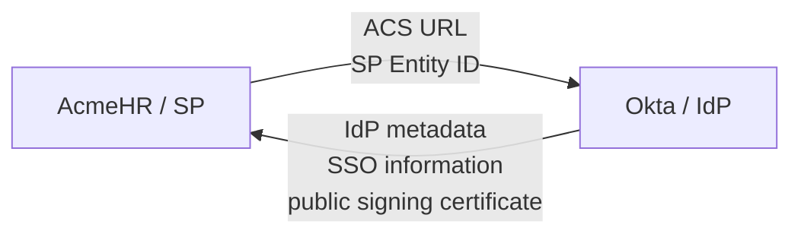
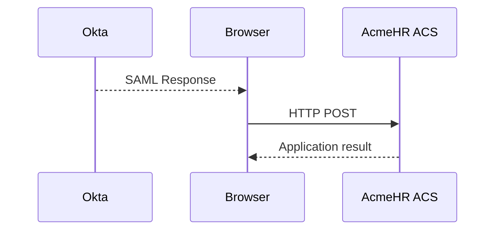
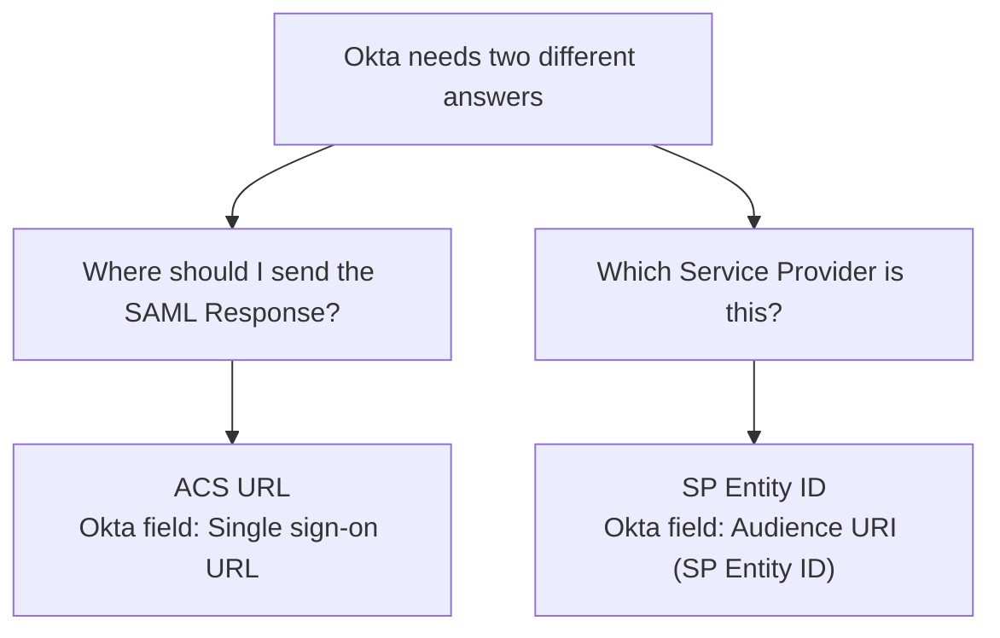
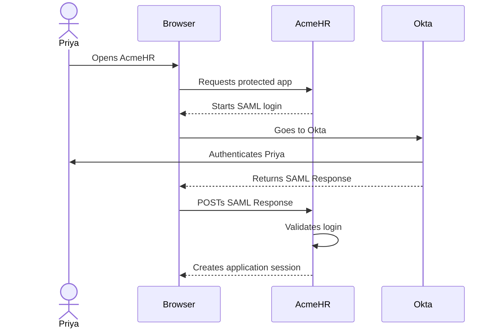

# Day 3: First Working Okta SAML SSO

## What you should understand by the end of today

Day 1 answered:

> Who is involved in SAML?

Day 2 answered:

> How does the browser carry the SAML transaction?

Today we connect those pieces and prepare the first real SAML integration between Okta and our AcmeHR training application.

By the end of Day 3, you should be able to explain:

- what information Okta needs from a Service Provider
- what information the Service Provider needs from Okta
- what the **Single sign-on URL** means in Okta
- what the **Audience URI (SP Entity ID)** means
- why the ACS URL and Entity ID are different
- what SAML metadata is used for
- why a user must be assigned to the Okta application
- what happens during the first SP-initiated login
- what evidence proves that the first end-to-end flow worked

Today is about making the integration work.

We are **not** going to dissect the AuthnRequest or SAML Response XML yet.

That comes after we have a real working transaction to inspect.

---

# 1. Start with the project requirement

Our Acme project now has a concrete requirement:

> Priya should open AcmeHR, be sent to Okta for authentication, and return to AcmeHR signed in.

From Day 1, we already know:

```text
Identity Provider
    -> Okta

Service Provider
    -> AcmeHR

User
    -> Priya

Transaction carrier
    -> Browser
```

From Day 2, we know the browser can carry:

```text
AcmeHR -> Okta
    through a browser redirect

Okta -> AcmeHR
    through a browser form POST
```

Now both sides need enough configuration to recognize each other.

---

# 2. Two systems must agree on the connection

A SAML integration is not configured only in Okta.

AcmeHR also needs SAML configuration.

Think of the setup as two sides exchanging information.

**Question answered:** What information moves during setup?



At a high level:

AcmeHR tells Okta:

> "Here is where I receive the login response, and here is the identifier that represents me."

Okta tells AcmeHR:

> "Here is the information you need to recognize and trust my SAML service."

That exchange is the configuration relationship.

---

# 3. What AcmeHR gives Okta

For our first working integration, the two most important SP values are:

1. the **ACS URL**
2. the **SP Entity ID**

We will understand each one before touching the Okta fields.

---

# 4. The ACS URL: where should Okta send the login response?

After Okta authenticates Priya, the browser needs to send the SAML Response somewhere on AcmeHR.

That receiving endpoint is called the **Assertion Consumer Service**, usually shortened to **ACS**.

For our training application, we will use an ACS URL similar to:

```text
http://localhost:8000/saml/acs
```

The exact lab value will come from the training SP.

Plain meaning:

> The ACS URL is the endpoint on AcmeHR that receives the SAML Response.

In the Okta custom SAML application, the corresponding field is:

> **Single sign-on URL**

Current Okta documentation describes this field as the place to enter the ACS URL.

---

## Diagram: where the ACS fits

**Question answered:** Where does the browser send the SAML Response?



The ACS is on the Service Provider side.

It is not the Okta login URL.

---

# 5. The SP Entity ID: which Service Provider is this?

AcmeHR also needs an identifier.

That identifier is called the **Service Provider Entity ID**, usually shortened to **SP Entity ID**.

For our training application, we will use an identifier similar to:

```text
urn:acme:training:sp
```

Notice something important.

That value is not where the browser POSTs the response.

It identifies the Service Provider.

Plain meaning:

> The SP Entity ID tells the SAML systems which Service Provider this configuration represents.

In the Okta custom SAML application, the corresponding field is:

> **Audience URI (SP Entity ID)**

Current Okta documentation describes this field as the unique identifier for the application.

---

# 6. ACS URL and Entity ID are not the same thing

This distinction must become natural.

```text
ACS URL
    -> Where should the SAML Response be sent?

SP Entity ID
    -> Which Service Provider does this integration represent?
```

For our example:

```text
ACS URL
http://localhost:8000/saml/acs

SP Entity ID
urn:acme:training:sp
```

Do not memorize those example values.

Understand their jobs.

---

## Diagram: destination versus identity

**Question answered:** Why do we need both an ACS URL and an Entity ID?



This is one of the most common beginner mistakes.

Do not treat the ACS URL and Entity ID as interchangeable fields just because both may sometimes look like URLs.

---

# 7. What Okta gives AcmeHR

AcmeHR also needs information about Okta.

A typical Service Provider needs enough information to know things such as:

- which Okta SAML service it should use
- which IdP identifier represents Okta
- which public certificate is associated with Okta's SAML signing
- which endpoints are available

Instead of copying each value manually, SAML commonly uses **metadata**.

---

# 8. What is SAML metadata?

SAML metadata is an XML document containing configuration information about a SAML system.

Do not worry about the XML today.

Think of metadata as:

> A machine-readable configuration package that one SAML system can give to the other.

For the Okta side, the metadata can contain information the SP needs to configure its trust relationship with Okta.

Current Okta documentation exposes a **Metadata URL** from the app's Sign On area, and also allows individual SAML values to be viewed separately.

---

## Why metadata helps

Without metadata, an engineer may need to copy several values manually.

With metadata, a Service Provider that supports metadata import can read those values from one document.

That reduces manual typing and helps avoid mismatched values.

Metadata does not remove the need to understand the configuration.

You should still know which side owns which values.

---

# 9. The setup exchange in plain language

Before the first login, the configuration relationship looks like this:

```text
AcmeHR gives Okta:

ACS URL
    Where Okta should return the login response

SP Entity ID
    The identifier representing AcmeHR


Okta gives AcmeHR:

IdP metadata
    Configuration information AcmeHR needs
    to recognize the Okta SAML service
```

Later lessons will open the metadata and certificates in more detail.

For Day 3, we only need to understand why the exchange exists.

---

# 10. Creating the Okta SAML application

Current Okta documentation describes the custom SAML app creation flow beginning from the Admin Console under:

```text
Applications and Resources
        ->
Applications
        ->
Create App Integration
```

Then select:

```text
SAML 2.0
```

The exact navigation can vary slightly by Okta org experience.

For example, current Okta documentation notes that some orgs may enter the custom integration through the **Classic experience**.

Do not let a small menu-label difference distract you.

The important part is that you are creating a custom **SAML 2.0 app integration**.

---

# 11. General Settings

The first step asks for basic application information.

For our course, the application name will be something clear such as:

```text
AcmeHR Training
```

This name helps the administrator and user identify the integration.

It is not the SP Entity ID.

It is simply the Okta application label.

That distinction matters:

```text
Application label
    -> Human-friendly name in Okta

SP Entity ID
    -> SAML identifier for the Service Provider
```

---

# 12. Configure SAML: the two fields we care about first

On the Configure SAML step, current Okta documentation includes:

```text
Single sign-on URL

Audience URI (SP Entity ID)
```

For our training project, the lab will provide values similar to:

```text
Single sign-on URL
http://localhost:8000/saml/acs

Audience URI (SP Entity ID)
urn:acme:training:sp
```

These values come from the SP.

Do not invent them.

In a real project, the application owner, vendor documentation, or SP metadata should tell you what the application expects.

---

# 13. The Recipient and Destination option

In the custom SAML configuration, Okta commonly shows an option similar to:

> **Use this for Recipient URL and Destination URL**

For our first training integration, we will keep that normal/default relationship so the same SSO URL is used for those values.

Do not try to understand Recipient and Destination yet.

They are important validation concepts, but they belong to the later validation lesson.

For Day 3, remember only:

> We are intentionally using the simple default configuration for the first working transaction.

Later we will open those validation fields and see what they mean.

---

# 14. What about Name ID format and Application username?

The SAML configuration also includes identity-related settings such as:

- **Name ID format**
- **Application username**

Those settings affect how the user is represented in the SAML Response.

They are important.

But today we do not need to design them.

For the first working training flow, we will use the lab's simple/default identity settings.

Day 5 will teach exactly what NameID is and how Okta's **Application username** affects its value.

Do not skip that later lesson just because today's login works.

---

# 15. What about attributes and groups?

Okta also supports sending additional user information.

Examples might include:

```text
first name
last name
department
employee ID
groups
```

We are not adding those today.

The goal of Day 3 is the smallest useful SAML integration that can produce a working login.

Claims, attributes, and groups are Day 7 topics.

A beginner should not have to debug five attribute mappings while still trying to understand the basic SSO connection.

---

# 16. Finish the Okta application

After entering the minimum SAML settings, complete the application creation flow.

Current Okta documentation may ask how the application should be categorized, such as whether it is an internal application.

For our training application:

> AcmeHR Training is an internal training application.

The exact wording of the final setup page can change over time.

The important result is:

> The SAML application exists in Okta and has the SP values configured.

---

# 17. Assignment: who is allowed to use this Okta application?

Creating the application does not automatically mean every Okta user can use it.

The test user must be **assigned** to the application.

Current Okta documentation places this under the app's:

```text
Assignments
```

tab and supports assignment to people or groups.

For our first test, assign only the training user you intend to use.

For example:

```text
Priya
    ->
AcmeHR Training
```

---

## Assignment is a separate layer

This is important.

```text
SAML configuration
    -> Describes the federation relationship

Assignment
    -> Controls which Okta users can access the app
```

A user can have a perfectly configured SAML application and still fail because they are not assigned.

That does not automatically mean the ACS or Entity ID is wrong.

Keep the layers separate.

---

# 18. Configure AcmeHR with Okta information

Now the other side must be configured.

The training SP needs Okta's SAML information.

For the course, the lab will use Okta's **Metadata URL** so the training SP can load the IdP configuration.

Current Okta documentation describes copying the Metadata URL from the app's **Sign On** area.

Some Service Providers may instead ask you to enter individual values manually.

For example, a vendor might ask for:

```text
IdP SSO URL
IdP Issuer
IdP signing certificate
```

The exact names vary by application.

Metadata is simply a convenient way to package those values.

---

# 19. Do not confuse the two SSO URLs

This is another common beginner problem.

You may encounter:

```text
Okta field:
Single sign-on URL

and

Okta's own IdP sign-in / SSO endpoint
```

They are not the same thing.

In the custom SAML app configuration:

> **Single sign-on URL** is the SP's ACS URL.

The IdP SSO endpoint belongs to Okta and is information the SP needs in order to send the browser toward Okta.

Keep the direction in mind.

---

## Direction check

```text
Okta -> SP

Where does Okta return the SAML Response?

Answer:
SP ACS URL
Okta field: Single sign-on URL


SP -> Okta

Where does the browser go for IdP SSO?

Answer:
Okta IdP SSO endpoint
Usually obtained through Okta metadata/configuration
```

That distinction will prevent many configuration mistakes.

---

# 20. What the local training SP will do

Starting with the Day 3 lab, we will use a local Service Provider built specifically for this course.

Its job is not to hide SAML from you.

Its job is to let you see each stage of the transaction clearly.

The training SP will eventually show whether stages such as these passed or failed:

```text
Login request generated

SAML Response received

Signature validation

Issuer check

Audience check

Endpoint checks

Time checks

User information processed

Application session created
```

You do **not** need to understand those validation stages today.

They will be opened gradually in later lessons.

---

# 21. The SP will validate securely even before you learn every check

This point is important.

The training SP must not weaken or disable SAML validation just because we have not taught every validation rule yet.

The SP will perform the required secure validation internally.

Day 3 only asks you to observe:

```text
Did the end-to-end login succeed?
```

Later days will open those validation layers one at a time.

We will not teach:

> "Disable validation until the lab works."

That would build the wrong engineering habit.

---

# 22. We will not hand-write SAML signature validation

The local training SP will use a maintained SAML implementation rather than custom code that tries to implement XML signature validation from scratch.

Before the first live Day 3 lab is finalized, the SAML library will be selected and pinned after checking:

- current maintenance status
- recent releases
- security advisories
- supported SAML validation behavior
- signed request support needed later
- encrypted assertion support needed later
- compatibility with the Dockerized training environment

The learner should focus on SAML engineering, not on reinventing security-sensitive XML processing.

---

# 23. Why the training SP will be Dockerized

SAML libraries can depend on runtime packages and cryptographic or XML components.

A fresher should not spend the first SAML lab fighting local dependency installation.

So the training SP will be packaged in Docker.

The goal is:

```text
Start the lab environment
        |
        v
Configure the SAML relationship
        |
        v
Run the transaction
        |
        v
Observe evidence
```

not:

```text
Spend hours fixing unrelated local dependencies
```

The lab environment is there to support learning.

---

# 24. What SP-initiated SSO means

Our first working flow will be **SP-initiated**.

That means the user starts from the Service Provider.

For us:

> Priya starts at AcmeHR.

AcmeHR then begins the SAML login and sends the browser toward Okta.

---

## Diagram: first working SP-initiated flow

**Question answered:** What should happen in our first working SAML transaction?



Day 4 will open the request going from AcmeHR toward Okta.

Day 5 will open the response coming back.

Today we need the whole path to work first.

---

# 25. Why we build success before breaking anything

There is no value in deliberately breaking Audience, certificates, attributes, or endpoints before you have seen a clean working transaction.

First prove:

```text
Configuration
      |
      v
Authentication
      |
      v
SAML Response returned
      |
      v
SP accepts login
      |
      v
Application session
```

That working transaction becomes your baseline.

Later, when we break one value, you can compare the failed transaction with the known-good transaction.

That is much better than troubleshooting an environment that has never worked.

---

# 26. What proves Day 3 success?

Seeing the Okta sign-in page is not enough.

Successfully entering a password is not enough.

Even successful MFA would not be enough.

For Day 3, success means the complete transaction reaches the Service Provider and the Service Provider creates its own application session.

The evidence should look like:

```text
1. Priya opens AcmeHR.

2. Browser is redirected toward Okta.

3. Okta authenticates Priya.

4. Browser returns to AcmeHR with the SAML Response.

5. AcmeHR accepts the login.

6. AcmeHR creates an application session.

7. Priya sees the protected AcmeHR page.
```

That is our first real baseline.

---

# 27. Successful authentication is still not successful SSO

Suppose Priya reaches Okta and signs in successfully.

Then the browser returns to AcmeHR and AcmeHR shows an error.

Can you say:

> "SSO works because Okta authentication succeeded"?

No.

You can only say:

> Okta authentication succeeded.

The SP still has to process and accept the SAML login.

This is the same separation we started learning on Day 1.

---

# 28. First Day 3 troubleshooting checkpoints

If the first login does not work, do not change several settings at once.

Follow the transaction.

Ask:

```text
Did the browser reach AcmeHR?

Did AcmeHR start the SAML login?

Did the browser reach Okta?

Did Okta authenticate Priya?

Did the browser return to AcmeHR?

Did AcmeHR create its application session?
```

Then ask:

> **What is the last step I can prove succeeded?**

At Day 3 level, that is enough.

We will not diagnose individual XML validation fields before they have been taught.

---

# 29. Common beginner mistakes on the first integration

## Mistake 1: using the Entity ID as the ACS URL

These values solve different problems.

```text
ACS
    -> receiving endpoint

Entity ID
    -> SP identifier
```

Do not swap them.

---

## Mistake 2: putting Okta's sign-in URL into the Single sign-on URL field

In the Okta custom SAML application:

> **Single sign-on URL** is the SP's ACS URL.

It is not asking for Okta's own IdP SSO endpoint.

---

## Mistake 3: forgetting assignment

The application can be configured correctly while the test user is not assigned.

Always confirm assignment before changing SAML protocol settings.

---

## Mistake 4: adding attributes before the basic login works

Do not add department, employee ID, groups, and other mappings just because the fields are visible.

First make the minimal login work.

Then add requirements one layer at a time.

---

## Mistake 5: changing several fields after one failure

If you change the ACS URL, Entity ID, NameID, assignment, and certificate settings all at once, you will not know which change mattered.

Change only the layer supported by the evidence.

---

# 30. What metadata does not mean

Metadata is useful, but do not treat it as magic.

Importing metadata does not automatically prove:

- the user is assigned
- the application account exists
- the SP will accept the user's identity
- all attributes are correct
- every security policy is satisfied

Metadata helps configure the SAML relationship.

The rest of the application behavior still matters.

---

# 31. A simple project intake conversation

Imagine the AcmeHR vendor tells you:

> To configure SAML, send us your IdP metadata. We will give you our ACS URL and Entity ID.

You should now understand the exchange.

The vendor gives you:

```text
ACS URL
SP Entity ID
```

You configure those values in Okta.

You give the vendor:

```text
Okta IdP metadata
```

The vendor configures its SP trust with Okta.

That is a normal SAML onboarding conversation.

---

# 32. Day 3 practice: map the values

Try each one before opening the answer.

### Value 1

```text
http://localhost:8000/saml/acs
```

What job does this value perform?

<details>
<summary>Check your answer</summary>

It is the **ACS URL**.

It tells Okta where the browser should POST the SAML Response on the SP side.

In the Okta custom SAML app, this maps to **Single sign-on URL**.

</details>

### Value 2

```text
urn:acme:training:sp
```

What job does this value perform?

<details>
<summary>Check your answer</summary>

It is the **SP Entity ID**.

It identifies the Service Provider.

In Okta, this maps to **Audience URI (SP Entity ID)**.

</details>

### Value 3

```text
Okta Metadata URL
```

Who primarily needs the information behind this value?

<details>
<summary>Check your answer</summary>

The **Service Provider** needs the Okta IdP configuration information.

The training SP can use Okta metadata to configure the IdP side of the trust relationship.

</details>

---

# 33. Day 3 practice: identify the mistake

An engineer enters:

```text
Single sign-on URL:
https://acme.okta.com/app/acmehr/sso/saml

Audience URI:
http://localhost:8000/saml/acs
```

What should make you suspicious?

<details>
<summary>Check your answer</summary>

The values appear to be reversed or misunderstood.

For our training integration:

```text
Single sign-on URL
    -> should be the SP ACS endpoint

Audience URI (SP Entity ID)
    -> should be the SP identifier
```

The engineer appears to have placed an Okta-side URL into the SP Single sign-on URL field and an ACS endpoint into the Entity ID field.

Always verify the values against the Service Provider's actual requirements before changing anything.

</details>

---

# 34. Day 3 practice: assignment or SAML configuration?

Scenario:

> The AcmeHR SAML settings match the known-good configuration. Priya receives an Okta message that she does not have access to the application.

What should you check before changing ACS or Entity ID values?

<details>
<summary>Check your answer</summary>

Check whether Priya is assigned to the AcmeHR application in Okta.

Assignment is a separate access layer from the SAML protocol configuration.

</details>

---

# 35. Day 3 practice: what counts as working?

Which result proves the strongest Day 3 success?

### A

Priya sees the Okta sign-in page.

### B

Priya enters the correct Okta password.

### C

Priya completes Okta authentication.

### D

Priya returns to AcmeHR and AcmeHR creates the application session.

<details>
<summary>Check your answer</summary>

**D**

Day 3 success is end-to-end.

The SP must receive and accept the login and create its application session.

</details>

---

# 36. What you should not analyze yet

When we run the Day 3 lab, you may see words such as:

- AuthnRequest
- Assertion
- Issuer
- Audience
- Destination
- Recipient
- InResponseTo
- NameID
- Signature

Do not start trying to memorize all of them.

The training SP may securely validate these values internally.

You will learn them in the order required to understand them.

Day 3 has one goal:

> Build and prove the first working SAML SSO transaction.

---

# Day 3 checkpoint

Before moving to the lab, you should be able to explain:

1. What does AcmeHR need to give Okta?
2. What does the ACS URL do?
3. What Okta field receives the ACS URL?
4. What does the SP Entity ID do?
5. What Okta field receives the SP Entity ID?
6. Why are ACS and Entity ID different?
7. What is SAML metadata used for?
8. Why does AcmeHR need Okta metadata?
9. Why must Priya be assigned to the Okta application?
10. What does SP-initiated mean?
11. What proves that the complete SSO flow worked?
12. Why is successful Okta authentication not enough by itself?
13. Why are we not adding attributes and groups yet?
14. Why will the training SP keep secure validation enabled even before you understand every validation field?

If you cannot explain one of those in plain language, review that section before starting the lab.

---

# Explain it back

Imagine the AcmeHR application owner asks:

> What information do you need from us, and what do you give us from Okta?

Explain it naturally.

A good answer could sound like:

> I need the Service Provider's ACS URL and Entity ID. The ACS URL tells Okta where to return the SAML Response, and the Entity ID tells Okta which Service Provider the integration represents. In Okta those map to Single sign-on URL and Audience URI. On the other side, AcmeHR needs Okta's IdP configuration, which we can normally provide through the Okta metadata. After both sides are configured and the test user is assigned, we can run an SP-initiated login and prove that AcmeHR creates its own application session.

Do not memorize those exact words.

If you can explain the relationship correctly in your own words, you are ready for the Day 3 lab.

---

# Day 3 completion standard

The Day 3 lesson is complete when you can:

- identify which values belong to the SP and which belong to Okta
- explain ACS without using protocol-heavy wording
- explain SP Entity ID without confusing it with an endpoint
- map ACS to Okta **Single sign-on URL**
- map SP Entity ID to Okta **Audience URI (SP Entity ID)**
- explain metadata as a configuration exchange
- explain why assignment is separate from SAML configuration
- describe the SP-initiated login from start to finish
- explain what evidence proves the first end-to-end login succeeded
- avoid diagnosing later SAML validation fields before they have been taught

The Day 3 lab will turn this design into the first working Okta-to-AcmeHR SAML transaction.

---

# Official references used for this lesson

- [Okta Developer: Create an app integration](https://developer.okta.com/docs/guides/create-an-app-integration/saml2/main/)
- [Okta Developer: Understanding SAML](https://developer.okta.com/docs/concepts/saml/)
