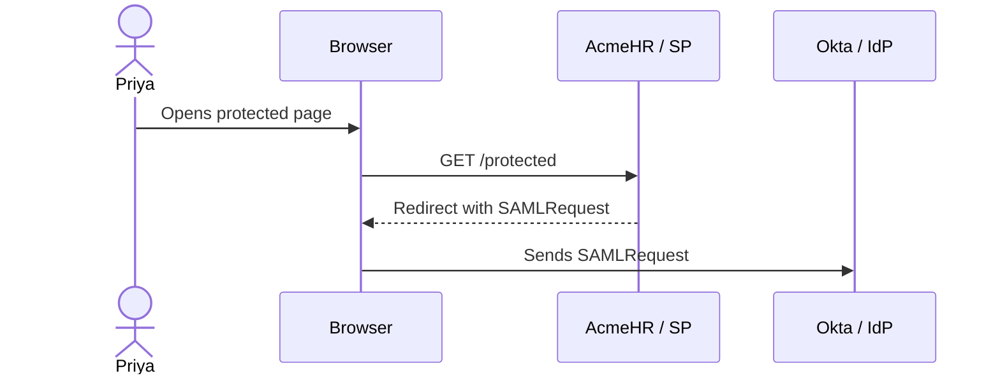
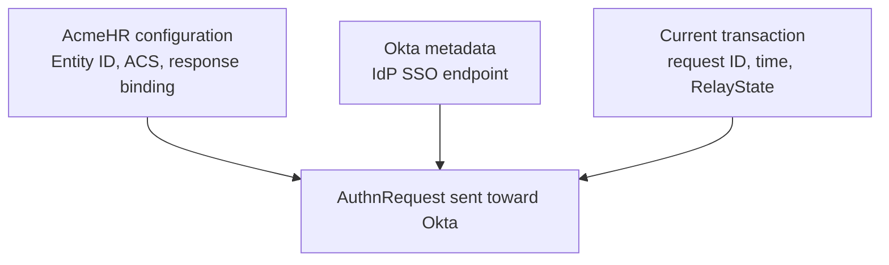
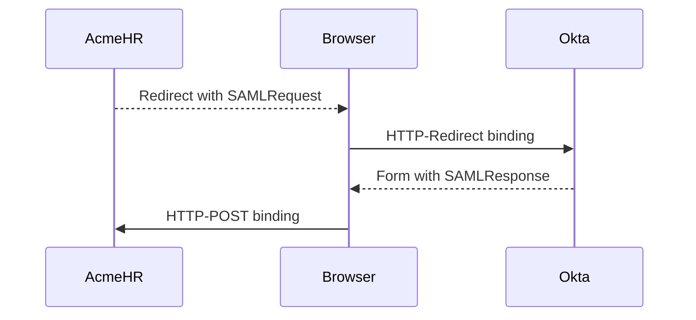

# Day 4: Understanding the AuthnRequest

## What you should understand by the end of today

On Day 3, Priya opened the protected AcmeHR page, the browser went to Okta, and AcmeHR created an application session after the browser returned.

Today we will open the first SAML message in that transaction:

> The **AuthnRequest** that AcmeHR sends toward Okta.

By the end of Day 4, you should be able to explain:

- why the Service Provider creates an AuthnRequest
- how the browser carries it to Okta
- how to capture and locally decode it
- what `ID`, `Version`, and `IssueInstant` mean
- why the request `Issuer` is AcmeHR, not Okta
- what `Destination` tells us
- what `AssertionConsumerServiceURL` tells Okta
- what `ProtocolBinding` requests for the return message
- what `NameIDPolicy` requests when it is present
- what `RequestedAuthnContext` requests when it is present
- why `RelayState` is separate from the AuthnRequest XML
- which values come from AcmeHR configuration, Okta metadata, or the current transaction
- what evidence a correct AuthnRequest gives you during troubleshooting

Today is about the request going from AcmeHR to Okta.

We are not opening the SAML Response or Assertion yet. Those belong to Day 5.

---

# 1. Start with the working Day 3 transaction

Our working requirement has not changed:

> Priya opens the protected AcmeHR page and signs in through Okta.

Day 3 proved the complete path:

```text
Priya opens AcmeHR
        |
        v
AcmeHR starts SAML login
        |
        v
Browser goes to Okta
        |
        v
Okta authenticates Priya
        |
        v
Browser returns to AcmeHR
        |
        v
AcmeHR creates an application session
```

Now we will slow down the first half of that path.

---

# 2. What is an AuthnRequest?

AcmeHR needs Okta to authenticate the user.

It sends a SAML message that asks Okta to begin that work.

That message is called an **authentication request**, written in SAML as:

```xml
<samlp:AuthnRequest>
```

You will usually hear engineers call it an **AuthnRequest**.

Plain meaning:

> AcmeHR is asking Okta to authenticate the browser user and return the SAML login result.

The AuthnRequest is XML before it is prepared for browser transport.

---

# 3. Who creates it?

In our SP-initiated flow, AcmeHR creates the AuthnRequest.

Okta receives it.

The browser carries it between them.

**Question answered:** Who creates the AuthnRequest and who receives it?



Keep the roles clear:

```text
Creator
    AcmeHR / Service Provider

Carrier
    Browser

Receiver
    Okta / Identity Provider
```

The browser does not create the AuthnRequest.

Okta does not create this request in an SP-initiated flow.

---

# 4. The first redirect is not yet the Okta redirect

The AcmeHR training application uses Spring Security.

When an unauthenticated browser requests:

```text
http://localhost:8000/protected
```

AcmeHR first redirects the browser to its local SAML request endpoint:

```text
/saml2/authenticate?registrationId=acmehr
```

That local endpoint creates the AuthnRequest.

It then returns another redirect. This second redirect points to the Okta SSO endpoint and carries a query parameter named:

```text
SAMLRequest
```

So the browser trace contains two different steps:

```text
1. /protected
      -> local AcmeHR SAML start endpoint

2. local AcmeHR SAML start endpoint
      -> Okta SSO endpoint with SAMLRequest
```

When you want to inspect the AuthnRequest, the second redirect is the useful one.

---

# 5. What the browser carries

Day 2 taught us that a common AuthnRequest uses HTTP-Redirect binding.

The XML goes through this transport process:

```text
AuthnRequest XML
        |
        v
DEFLATE compression
        |
        v
Base64 encoding
        |
        v
URL encoding
        |
        v
SAMLRequest query parameter
```

The browser request toward Okta may look like:

```text
https://your-okta-domain.okta.com/app/.../sso/saml
    ?SAMLRequest=...
    &RelayState=...
```

The encoded `SAMLRequest` value is not readable XML yet.

---

# 6. Capture and decode in the correct order

Use the browser Network view from the known-good Day 3 transaction.

Find the request going to the Okta SSO endpoint and inspect its query parameters.

The normal decoding path is:

```text
Captured SAMLRequest
        |
        v
URL decode, if the browser tool has not already done it
        |
        v
Base64 decode
        |
        v
DEFLATE decompress
        |
        v
AuthnRequest XML
```

Some browser tools display query parameters after URL decoding.

Check what the tool already did before decoding the value again.

Use the local course decoder in the Day 4 lab. Do not paste a production request or its `RelayState` into a random public decoder.

---

# 7. First look at the AcmeHR request

The following is a shortened, representative version of the request created by the current AcmeHR training SP.

Your request `ID`, `IssueInstant`, and Okta `Destination` will be different.

```xml
<saml2p:AuthnRequest
    xmlns:saml2p="urn:oasis:names:tc:SAML:2.0:protocol"
    AssertionConsumerServiceURL="http://localhost:8000/saml/acs"
    Destination="https://your-okta-domain.okta.com/app/.../sso/saml"
    ForceAuthn="false"
    ID="ARQ7b2f..."
    IsPassive="false"
    IssueInstant="2026-09-22T07:15:30Z"
    ProtocolBinding="urn:oasis:names:tc:SAML:2.0:bindings:HTTP-POST"
    Version="2.0">

    <saml2:Issuer
        xmlns:saml2="urn:oasis:names:tc:SAML:2.0:assertion">
        urn:acme:training:sp
    </saml2:Issuer>
</saml2p:AuthnRequest>
```

Do not try to memorize the XML.

We will read one field at a time.

`ForceAuthn` and `IsPassive` are visible because the current SAML library writes their default `false` values. They are advanced request controls and are not part of today's design work.

---

# 8. Read the request as a set of questions

Each important field answers a practical question.

| Field | Question it answers |
|---|---|
| `ID` | Which request is this? |
| `Version` | Which SAML version does this request use? |
| `IssueInstant` | When did AcmeHR create it? |
| `Issuer` | Which SAML entity created it? |
| `Destination` | Which IdP endpoint should receive it? |
| `AssertionConsumerServiceURL` | Where should the response return? |
| `ProtocolBinding` | How should the response be delivered? |
| `NameIDPolicy` | What kind of user identifier is requested? |
| `RequestedAuthnContext` | What authentication context is requested? |
| `RelayState` | What application state should survive the round trip? |

The last three need a qualification:

- `NameIDPolicy` is optional and is absent from the current AcmeHR request.
- `RequestedAuthnContext` is optional and is absent from the current AcmeHR request.
- `RelayState` is an HTTP parameter beside `SAMLRequest`, not an XML field inside `AuthnRequest`.

---

# 9. ID: which request is this?

Every SAML request needs its own identifier.

That value appears in:

```xml
ID="ARQ7b2f..."
```

Plain meaning:

> This value identifies this specific AuthnRequest.

It is not:

- Priya's user ID
- the Okta application ID
- the AcmeHR Entity ID
- the browser session ID

The SP creates a new request ID for a new authentication request.

Later, the corresponding SAML Response can refer to this value through `InResponseTo`.

That relationship helps the SP connect a returned response to the request it created. We will inspect the return side and its validation in later lessons.

---

# 10. Version: which SAML protocol version?

The request contains:

```xml
Version="2.0"
```

Plain meaning:

> AcmeHR created this as a SAML 2.0 request.

This is the protocol version.

It is not the AcmeHR application version, Spring Security version, or Okta release version.

---

# 11. IssueInstant: when was the request created?

The request contains a timestamp:

```xml
IssueInstant="2026-09-22T07:15:30Z"
```

Plain meaning:

> AcmeHR created this request at this time.

The `Z` indicates UTC.

`IssueInstant` is created for each transaction. It does not come from a static Okta application field.

It is also not an expiration time by itself.

Time validation will receive deeper treatment on Day 6.

---

# 12. Issuer: which SAML entity created the request?

The request contains:

```xml
<saml2:Issuer>urn:acme:training:sp</saml2:Issuer>
```

Plain meaning:

> AcmeHR created this AuthnRequest.

The value is the AcmeHR SP Entity ID:

```text
urn:acme:training:sp
```

This is the same SP identifier we entered in Okta as:

> **Audience URI (SP Entity ID)**

The direction matters.

```text
AuthnRequest Issuer
    -> AcmeHR / SP

SAML Response Issuer
    -> Okta / IdP
```

We have not opened the response yet, but this distinction prevents a common mistake.

Do not replace the AuthnRequest `Issuer` with the Okta issuer.

---

# 13. Destination: where is the request intended to go?

The request contains an Okta endpoint:

```xml
Destination="https://your-okta-domain.okta.com/app/.../sso/saml"
```

Plain meaning:

> This AuthnRequest is intended for this Okta SSO endpoint.

AcmeHR obtains that endpoint from the Okta IdP metadata supplied on Day 3.

The browser's actual redirect location should point to the same Okta SSO endpoint.

Do not confuse `Destination` with the ACS URL.

```text
Destination
    Request goes to Okta

AssertionConsumerServiceURL
    Response returns to AcmeHR
```

The `Destination` field declares the intended receiver inside the SAML message. The HTTP `Location` header tells the browser where to go.

For a correct request, those two pieces should agree.

---

# 14. AssertionConsumerServiceURL: where should the response return?

The request contains:

```xml
AssertionConsumerServiceURL="http://localhost:8000/saml/acs"
```

Plain meaning:

> After authentication, return the SAML Response to this AcmeHR endpoint.

This is the same AcmeHR ACS URL used on Day 3:

```text
http://localhost:8000/saml/acs
```

In the Okta application, the matching field is:

> **Single sign-on URL**

The long XML attribute name and the shorter engineering term refer to the same SP endpoint:

```text
AssertionConsumerServiceURL
        =
ACS URL
```

The value is present in the request, but an IdP should not trust an arbitrary return URL merely because the browser supplied it.

For our unsigned Day 3 baseline, the request value should match the ACS URL already configured for the Okta application.

---

# 15. ProtocolBinding: how should Okta return the response?

The request contains:

```xml
ProtocolBinding="urn:oasis:names:tc:SAML:2.0:bindings:HTTP-POST"
```

Plain meaning:

> AcmeHR is asking Okta to return the SAML Response using HTTP-POST binding.

This field does **not** describe how the AuthnRequest reached Okta.

Our working transaction uses:

```text
AuthnRequest
    HTTP-Redirect binding

SAML Response
    HTTP-POST binding
```

That is why the request travels in a `SAMLRequest` query parameter, while the response later travels in a form field named `SAMLResponse`.

The long `urn:oasis...HTTP-POST` value is an identifier for the binding.

It is not a web page you need to open.

---

# 16. NameIDPolicy: what kind of user identifier is requested?

An AuthnRequest can ask the IdP to use a particular type of user identifier in the returned assertion.

That optional request appears in a `NameIDPolicy` element.

For example:

```xml
<samlp:NameIDPolicy
    Format="urn:oasis:names:tc:SAML:1.1:nameid-format:emailAddress"/>
```

Plain meaning:

> Return a NameID using this requested format.

This element requests a format. It does not contain Priya's actual NameID value.

Current Okta documentation says that when `NameIDPolicy` is included in the request, the Okta **Name ID format** must match it.

## What you should see in AcmeHR today

The current AcmeHR registration does not configure a requested NameID format.

Therefore, its normal Day 4 AuthnRequest should not contain `NameIDPolicy`.

That absence is valid.

Do not add the element by hand to make the XML look more complete.

Day 5 will teach NameID and its value. Day 9 will revisit `NameIDPolicy` when signed AuthnRequests are enabled, because Okta requires this element when its **Signed Requests** option is enabled.

---

# 17. RequestedAuthnContext: what authentication context is requested?

An SP can optionally ask for an authentication context.

That request can look like:

```xml
<samlp:RequestedAuthnContext Comparison="exact">
    <saml:AuthnContextClassRef>
        urn:oasis:names:tc:SAML:2.0:ac:classes:PasswordProtectedTransport
    </saml:AuthnContextClassRef>
</samlp:RequestedAuthnContext>
```

Plain meaning:

> The SP is asking the IdP for an authentication result that matches this context.

`RequestedAuthnContext` is not a user attribute.

It also does not mean that an SP can casually force any Okta authentication method it wants. The request, Okta configuration, and authentication policy must agree on supported behavior.

## What you should see in AcmeHR today

The current AcmeHR training SP does not request an authentication context.

Its Day 4 AuthnRequest should not contain `RequestedAuthnContext`.

Okta authentication policy and MFA belong to Day 10. Today, recognize this element and understand why it may be absent.

---

# 18. RelayState: application state beside the SAML message

The redirect URL may contain:

```text
SAMLRequest=...
RelayState=...
```

`RelayState` is not inside the AuthnRequest XML.

It is a separate HTTP parameter that travels with the SAML message.

Plain meaning:

> Preserve a piece of SP-side transaction context while the browser makes the round trip through the IdP.

An SP can use RelayState for a deep link or an opaque state reference.

For the current AcmeHR implementation, Spring Security generates an opaque UUID-like value. Do not expect it to be a readable page URL.

When an IdP receives RelayState with a SAML request, the SAML binding requires the IdP to return the same value with the corresponding response.

RelayState is not:

- the AuthnRequest `ID`
- Priya's username
- the SP Entity ID
- part of the assertion

We will study deep links and RelayState behavior in more detail on Day 11.

---

# 19. Three places the request values come from

The AuthnRequest is not one block of manually typed XML.

The SAML library builds it from configuration and new transaction data.

**Question answered:** Where do the AuthnRequest values come from?



For AcmeHR:

| Value | Source |
|---|---|
| `ID` | Generated for this request |
| `Version` | SAML library uses `2.0` |
| `IssueInstant` | Current UTC time |
| `Issuer` | AcmeHR SP Entity ID |
| `Destination` | Okta SSO endpoint loaded from IdP metadata |
| `AssertionConsumerServiceURL` | AcmeHR ACS configuration |
| `ProtocolBinding` | AcmeHR response-binding configuration, currently HTTP-POST |
| `NameIDPolicy` | Absent because no requested format is configured |
| `RequestedAuthnContext` | Absent because none is configured |
| `RelayState` | Generated per transaction and sent outside the XML |

This table is more useful than memorizing XML order.

---

# 20. Map the request back to AcmeHR and Okta

The captured message should connect to the configuration you already know.

| Captured value | AcmeHR or Okta relationship |
|---|---|
| `Issuer="urn:acme:training:sp"` | AcmeHR SP Entity ID; same SP identifier entered in Okta as **Audience URI (SP Entity ID)** |
| `Destination="https://...okta.../sso/saml"` | Okta IdP SSO endpoint loaded from Okta metadata |
| `AssertionConsumerServiceURL="http://localhost:8000/saml/acs"` | AcmeHR ACS; configured in Okta as **Single sign-on URL** |
| `ProtocolBinding="...HTTP-POST"` | AcmeHR asks Okta to return the response by POST |
| `NameIDPolicy`, when present | Requested format must align with Okta **Name ID format** |
| `ID` and `IssueInstant` | Generated transaction values; no static Okta Admin Console field |
| `RelayState` | SP-initiated transaction state; not the same as Okta **Default RelayState** |

Okta **Default RelayState** is a separate app setting used for a default post-login destination when no request RelayState supplies that context.

Day 11 will compare SP-initiated and IdP-initiated use of RelayState.

---

# 21. Request binding and response binding are different

This is a common source of confusion.

The browser sends our AuthnRequest to Okta using HTTP-Redirect binding.

Inside that request, `ProtocolBinding` asks Okta to return the response using HTTP-POST binding.

**Question answered:** Why can one transaction use both Redirect and POST?



The field name `ProtocolBinding` means:

> Use this binding for the response to my request.

It does not mean:

> This request arrived using this binding.

---

# 22. What about signed AuthnRequests?

An SP can sign an AuthnRequest.

Not every SP signs them, and our Day 3 baseline does not configure an AcmeHR request-signing credential.

For an unsigned Redirect-binding request, you normally see:

```text
SAMLRequest
RelayState
```

When Redirect-binding request signing is enabled, you can also see:

```text
SigAlg
Signature
```

Those query parameters let Okta verify who signed the request and whether the signed redirect data changed.

Current Okta configuration exposes a **Signed Requests** option after an SP signature certificate is uploaded. When enabled, Okta validates the request and can read SSO URLs dynamically from the signed request.

Do not enable that option in the Day 4 baseline.

Request signing, the SP private key, the public certificate uploaded to Okta, and signature verification belong to Day 9.

---

# 23. What the AuthnRequest does not prove

A well-formed request does not prove that the whole SSO transaction succeeded.

If you decode a correct AuthnRequest, you can prove:

- AcmeHR generated a SAML authentication request
- the request identifies AcmeHR as the issuer
- it targets an Okta SSO endpoint
- it declares the AcmeHR ACS URL
- it requests HTTP-POST for the response

You cannot prove yet:

- Okta authenticated Priya
- Okta returned a SAML Response
- the returned signature was valid
- the response was intended for AcmeHR
- the user identity was correct
- AcmeHR created an application session

Those facts require evidence from later parts of the transaction.

The AuthnRequest is one checkpoint, not the whole login.

---

# 24. What successful Day 4 evidence looks like

Start with the known-good Day 3 transaction.

The request-side evidence should show:

```text
[PASS] Browser requested the protected AcmeHR page

[PASS] AcmeHR redirected to its SAML request endpoint

[PASS] AcmeHR created a redirect toward the Okta SSO endpoint

[PASS] Redirect contained SAMLRequest

[PASS] SAMLRequest decoded into AuthnRequest XML

[PASS] Issuer was urn:acme:training:sp

[PASS] Destination matched the Okta SSO endpoint

[PASS] AssertionConsumerServiceURL was
       http://localhost:8000/saml/acs

[PASS] ProtocolBinding requested HTTP-POST
```

That becomes the request-side baseline.

---

# 25. Troubleshoot from the last proven step

Suppose Priya clicks the protected page and never reaches Okta.

Do not start by checking NameID or response signatures. The response does not exist yet.

Ask:

```text
Did /protected redirect to the local SAML start endpoint?

Did the local SAML start endpoint return a redirect?

Did that redirect target the expected Okta SSO URL?

Did the redirect contain SAMLRequest?

Could the SAMLRequest be decoded?

Did the decoded request contain the expected Issuer, Destination, and ACS?
```

Then ask the course question:

> **What is the last step I can prove succeeded?**

Stay on the request side until the browser reaches Okta.

---

# 26. Common request-side mistakes

## Mistake 1: reading the Issuer as Okta

In an AuthnRequest, the issuer is the requester.

For our flow:

```text
AuthnRequest Issuer
    urn:acme:training:sp
    AcmeHR
```

Okta will be the issuer of the response, which we inspect on Day 5.

---

## Mistake 2: treating Destination as the return URL

`Destination` points toward Okta.

`AssertionConsumerServiceURL` points back toward AcmeHR.

Read the direction before changing either value.

---

## Mistake 3: reading ProtocolBinding as the request transport

The request traveled by Redirect.

`ProtocolBinding` asks for the response by POST.

Both bindings appear in one transaction.

---

## Mistake 4: expecting NameIDPolicy in every request

`NameIDPolicy` is optional.

The current AcmeHR request omits it because no requested NameID format is configured.

Absence is not automatically an error.

---

## Mistake 5: looking for RelayState inside the XML

`RelayState` travels beside `SAMLRequest` as an HTTP parameter.

Search the redirect query parameters, not the AuthnRequest XML.

---

## Mistake 6: trusting any ACS found in an unsigned browser request

The browser carrying a value does not make that value trusted.

For our baseline, the request ACS should match the **Single sign-on URL** already configured in Okta.

Do not solve a mismatch by allowing arbitrary return URLs.

---

# 27. Practice: identify each field

Try each one before opening the answer.

### Value 1

```xml
ID="ARQ9f31..."
```

What does it identify?

<details>
<summary>Check your answer</summary>

It identifies this specific AuthnRequest.

It does not identify the user or application.

</details>

### Value 2

```xml
<saml2:Issuer>urn:acme:training:sp</saml2:Issuer>
```

Who created the request?

<details>
<summary>Check your answer</summary>

AcmeHR created it.

The issuer value is the AcmeHR SP Entity ID.

</details>

### Value 3

```xml
Destination="https://your-okta-domain.okta.com/app/.../sso/saml"
```

Which direction does this point?

<details>
<summary>Check your answer</summary>

It points from AcmeHR toward the Okta IdP SSO endpoint.

</details>

### Value 4

```xml
AssertionConsumerServiceURL="http://localhost:8000/saml/acs"
```

Which direction does this point?

<details>
<summary>Check your answer</summary>

It points back to the AcmeHR ACS, where the browser should POST the SAML Response.

</details>

---

# 28. Practice: which binding does the field describe?

You capture:

```xml
ProtocolBinding="urn:oasis:names:tc:SAML:2.0:bindings:HTTP-POST"
```

The AuthnRequest arrived at Okta through a redirect URL.

Is that a contradiction?

<details>
<summary>Check your answer</summary>

No.

The AuthnRequest used HTTP-Redirect binding on the way to Okta.

`ProtocolBinding` asks Okta to return the SAML Response using HTTP-POST binding.

</details>

---

# 29. Practice: present, absent, or outside the XML?

For the current AcmeHR baseline, classify each item.

| Item | Present, absent, or outside? |
|---|---|
| `Issuer` | ? |
| `AssertionConsumerServiceURL` | ? |
| `NameIDPolicy` | ? |
| `RequestedAuthnContext` | ? |
| `RelayState` | ? |

<details>
<summary>Check your answer</summary>

| Item | Expected location |
|---|---|
| `Issuer` | Present in the AuthnRequest XML |
| `AssertionConsumerServiceURL` | Present in the AuthnRequest XML |
| `NameIDPolicy` | Absent from the current baseline |
| `RequestedAuthnContext` | Absent from the current baseline |
| `RelayState` | Present as a separate redirect query parameter |

</details>

---

# 30. Practice: map evidence to its source

You decode a request and find:

```text
Issuer
urn:acme:training:sp

Destination
https://your-okta-domain.okta.com/app/.../sso/saml

AssertionConsumerServiceURL
http://localhost:8000/saml/acs

IssueInstant
2026-09-22T07:15:30Z
```

Where did each value come from?

<details>
<summary>Check your answer</summary>

`Issuer` came from the AcmeHR SP Entity ID configuration.

`Destination` came from the Okta IdP SSO endpoint loaded through Okta metadata.

`AssertionConsumerServiceURL` came from the AcmeHR ACS configuration.

`IssueInstant` was generated from the current time for this transaction.

</details>

---

# 31. Day 4 checkpoint

Before moving to the lab, you should be able to explain:

1. What is AcmeHR asking Okta to do with an AuthnRequest?
2. Who creates the AuthnRequest?
3. What role does the browser play?
4. Which redirect contains `SAMLRequest`?
5. What decoding order is used for the Redirect-binding request?
6. What does `ID` identify?
7. Why can a later response refer to that ID?
8. What does `IssueInstant` tell you?
9. Why is the request `Issuer` AcmeHR?
10. Where does `Destination` point?
11. Where does `AssertionConsumerServiceURL` point?
12. What does `ProtocolBinding` ask Okta to do?
13. Why is `NameIDPolicy` absent from the current request?
14. Why is `RequestedAuthnContext` absent?
15. Where do you find `RelayState`?
16. Which values came from AcmeHR configuration?
17. Which value came from Okta metadata?
18. Why does a correct AuthnRequest not prove that SSO succeeded?

If one answer still feels unclear, return to that field and follow its direction through the transaction.

---

# Explain it back

Imagine a new engineer asks:

> What is AcmeHR sending to Okta before the user signs in?

Explain it naturally.

A good explanation could sound like:

> AcmeHR creates an AuthnRequest and sends it to Okta through the browser. The request identifies AcmeHR as the issuer, names the Okta SSO endpoint as its destination, tells Okta which AcmeHR ACS should receive the response, and asks for the response through HTTP-POST binding. The request also has a unique ID and creation time. In our current baseline, NameIDPolicy and RequestedAuthnContext are not included. RelayState travels beside the request as a separate HTTP parameter so transaction context can survive the round trip.

Do not memorize those exact words.

If you can explain who created each important value and which direction it points, you understand the Day 4 request.

---

# Day 4 completion standard

The Day 4 lesson is complete when you can:

- locate the real `SAMLRequest` in the Day 3 browser flow
- explain the Redirect-binding decoding order
- identify the root `AuthnRequest` element
- explain `ID`, `Version`, and `IssueInstant`
- identify AcmeHR as the request `Issuer`
- map the `Issuer` to the SP Entity ID
- distinguish `Destination` from `AssertionConsumerServiceURL`
- map the ACS back to Okta **Single sign-on URL**
- explain that `ProtocolBinding` requests the return binding
- recognize optional `NameIDPolicy` and `RequestedAuthnContext`
- explain why both are absent from the current AcmeHR request
- find `RelayState` outside the XML
- distinguish static configuration values from per-request values
- use request-side evidence to find the last proven successful step
- avoid analyzing the SAML Response before Day 5

The Day 4 lab will capture the real AcmeHR request, decode it locally, and compare every important value with the running configuration.

---

# Official references used for this lesson

- [OASIS: Assertions and Protocols for SAML 2.0](https://docs.oasis-open.org/security/saml/v2.0/saml-core-2.0-os.pdf)
- [OASIS: Bindings for SAML 2.0](https://docs.oasis-open.org/security/saml/v2.0/saml-bindings-2.0-os.pdf)
- [Okta Developer: Understanding SAML](https://developer.okta.com/docs/concepts/saml/)
- [Okta Help: Application Integration Wizard SAML field reference](https://help.okta.com/oie/en-us/content/topics/apps/aiw-saml-reference.htm)
- [Spring Security: Producing AuthnRequests](https://docs.spring.io/spring-security/reference/servlet/saml2/login/authentication-requests.html)
