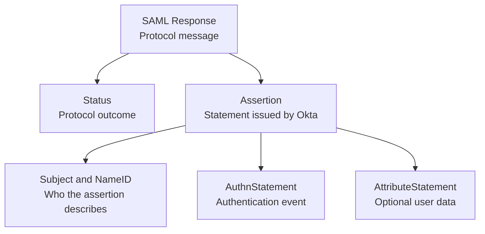

# Day 5: SAML Response, Assertion, Subject, and NameID

## What you should understand by the end of today

On Day 4, AcmeHR created an AuthnRequest and sent it toward Okta through the browser.

Today we open the message that comes back:

> The **SAML Response** that Okta returns to AcmeHR after authentication.

By the end of Day 5, you should be able to explain:

- how the browser carries the SAML Response to the AcmeHR ACS
- why HTTP-POST Response decoding differs from HTTP-Redirect request decoding
- how a SAML Response differs from the Assertion inside it
- why Okta is the issuer on the return side
- what the Response status reports
- what the Assertion says about the authenticated subject
- what `NameID` identifies
- how Okta **Application username** affects the NameID value
- how **Name ID format** differs from the NameID value
- what `SubjectConfirmation` is doing at a high level
- what `AuthnStatement` records
- where additional user attributes can appear
- which parts belong to Day 6 validation rather than Day 5 message reading
- what evidence a captured Response proves and what it does not prove

Today is about reading the returned message and identifying the user represented by it.

Detailed validation belongs to Day 6. Certificates and signatures belong to Day 8.

---

# 1. Continue the same working transaction

Our requirement is still:

> Priya opens the protected AcmeHR page and signs in through Okta.

Day 4 stopped on the request side:

```text
AcmeHR creates AuthnRequest
        |
        v
Browser sends it to Okta
```

Day 5 follows the return side:

```text
Okta authenticates Priya
        |
        v
Okta creates SAML Response
        |
        v
Browser POSTs it to AcmeHR ACS
        |
        v
AcmeHR processes the Response
```

We are opening a real message from the same known-good Day 3 integration.

---

# 2. Who creates the SAML Response?

Okta creates the SAML Response.

AcmeHR receives it.

The browser carries it between them.

Keep the roles clear:

```text
Creator
    Okta / Identity Provider

Carrier
    Browser

Receiver
    AcmeHR / Service Provider
```

The browser does not decide whether Priya authenticated successfully.

It transports the message that Okta created.

AcmeHR must process that message before it creates an authenticated application session.

---

# 3. How the browser carries the Response

The Day 4 AuthnRequest traveled in a URL query parameter through HTTP-Redirect binding.

The SAML Response normally returns through HTTP-POST binding in our training flow.

Okta returns an HTML form containing fields similar to:

```html
<form method="post" action="http://localhost:8000/saml/acs">
    <input type="hidden" name="SAMLResponse" value="..." />
    <input type="hidden" name="RelayState" value="..." />
</form>
```

The browser submits that form to the AcmeHR ACS.

The Response transport path is:

```text
SAML Response XML
        |
        v
Base64 encoding
        |
        v
SAMLResponse form field
        |
        v
HTTP POST to AcmeHR ACS
```

The HTTP-POST binding does not apply the raw DEFLATE step used by the Day 4 Redirect-binding request.

---

# 4. Capture and decode in the correct order

Use the browser Network trace from the working SP-initiated login.

Find the POST request to:

```text
http://localhost:8000/saml/acs
```

The form data should contain:

```text
SAMLResponse
RelayState
```

The normal decoding path is:

```text
Captured SAMLResponse
        |
        v
Base64 decode
        |
        v
SAML Response XML
```

Do not use the Redirect-binding DEFLATE command from Day 4 on this value.

The Day 5 lab will provide a local decoder. Do not paste a real SAML Response into a public decoder.

A Response can contain identity values, attributes, session references, endpoints, timestamps, and signatures.

---

# 5. Response and Assertion are not the same object

Engineers often use the words **Response** and **Assertion** as if they mean the same thing.

They are related, but they have different jobs.

The **Response** is the protocol message returned to AcmeHR.

The **Assertion** is the statement inside the Response about the authenticated subject and authentication event.



A common browser SSO Response contains one Assertion.

SAML can support other structures, but one Response with one Assertion is the working shape for this course.

---

# 6. First look at a shortened Response

The following example shows the parts we need today.

Values such as IDs, timestamps, Okta identifiers, and NameID will differ in your transaction.

```xml
<saml2p:Response
    xmlns:saml2p="urn:oasis:names:tc:SAML:2.0:protocol"
    Destination="http://localhost:8000/saml/acs"
    ID="id-response-..."
    InResponseTo="ARQ..."
    IssueInstant="2026-09-22T08:10:00Z"
    Version="2.0">

    <saml2:Issuer xmlns:saml2="urn:oasis:names:tc:SAML:2.0:assertion">
        http://www.okta.com/exk...
    </saml2:Issuer>

    <saml2p:Status>
        <saml2p:StatusCode
            Value="urn:oasis:names:tc:SAML:2.0:status:Success"/>
    </saml2p:Status>

    <saml2:Assertion
        xmlns:saml2="urn:oasis:names:tc:SAML:2.0:assertion"
        ID="id-assertion-..."
        IssueInstant="2026-09-22T08:10:00Z"
        Version="2.0">

        <saml2:Issuer>http://www.okta.com/exk...</saml2:Issuer>

        <saml2:Subject>
            <saml2:NameID
                Format="urn:oasis:names:tc:SAML:1.1:nameid-format:unspecified">
                priya@example.com
            </saml2:NameID>

            <saml2:SubjectConfirmation
                Method="urn:oasis:names:tc:SAML:2.0:cm:bearer">
                <saml2:SubjectConfirmationData
                    InResponseTo="ARQ..."
                    NotOnOrAfter="2026-09-22T08:15:00Z"
                    Recipient="http://localhost:8000/saml/acs"/>
            </saml2:SubjectConfirmation>
        </saml2:Subject>

        <saml2:AuthnStatement
            AuthnInstant="2026-09-22T08:09:58Z"
            SessionIndex="id-session-...">
            <saml2:AuthnContext>
                <saml2:AuthnContextClassRef>
                    urn:oasis:names:tc:SAML:2.0:ac:classes:PasswordProtectedTransport
                </saml2:AuthnContextClassRef>
            </saml2:AuthnContext>
        </saml2:AuthnStatement>
    </saml2:Assertion>
</saml2p:Response>
```

This is a teaching example, not a template to copy into Okta.

Your Response may contain digital-signature XML and additional sections.

We will read the message from the outside inward.

---

# 7. Read the message as a set of questions

| Location | Field or element | Question it answers |
| --- | --- | --- |
| Response | `ID` | Which Response message is this? |
| Response | `InResponseTo` | Which AuthnRequest is Okta answering? |
| Response | `IssueInstant` | When did Okta create the Response? |
| Response | `Destination` | Which SP endpoint should receive it? |
| Response | `Issuer` | Which SAML entity created the Response? |
| Response | `Status` | What protocol result did Okta report? |
| Assertion | `ID` | Which Assertion is this? |
| Assertion | `Issuer` | Which entity issued the Assertion? |
| Assertion | `Subject` | Who does the Assertion describe? |
| Assertion | `NameID` | What identifier represents the subject? |
| Assertion | `SubjectConfirmation` | How is the subject presented for this login? |
| Assertion | `AuthnStatement` | What authentication event does Okta report? |
| Assertion | `AttributeStatement` | What additional values did Okta send? |

Do not read every timestamp and endpoint as a complete validation exercise yet.

Day 5 identifies the structure and meaning. Day 6 checks whether AcmeHR should trust and accept it.

---

# 8. Response ID and Assertion ID

The outer Response has an ID:

```xml
<saml2p:Response ID="id-response-...">
```

The inner Assertion has its own ID:

```xml
<saml2:Assertion ID="id-assertion-...">
```

These are two different XML objects, so they have different identifiers.

Neither value is:

- Priya's username
- the Okta application ID
- the AcmeHR SP Entity ID
- the AuthnRequest ID
- the AcmeHR application-session ID

When someone reports a "SAML ID," ask which object they mean.

```text
AuthnRequest ID
Response ID
Assertion ID
SessionIndex
```

Those values are not interchangeable.

---

# 9. InResponseTo connects the return to the request

The outer Response can contain:

```xml
InResponseTo="ARQ..."
```

That value should refer to the AuthnRequest ID created by AcmeHR.

The same request ID can also appear inside `SubjectConfirmationData`.

Plain meaning:

> Okta is returning this result in response to that authentication request.

Day 4 introduced the request ID.

Day 6 will examine how AcmeHR validates the correlation.

For today, recognize that `InResponseTo` points backward to the request. It is not the Response ID.

---

# 10. Destination points back to AcmeHR

The Response contains:

```xml
Destination="http://localhost:8000/saml/acs"
```

Plain meaning:

> This Response is intended for the AcmeHR ACS endpoint.

Compare the directions:

```text
AuthnRequest Destination
    Okta SSO endpoint

SAML Response Destination
    AcmeHR ACS endpoint
```

The browser's actual POST target should also be the AcmeHR ACS.

Day 6 will turn that observation into a validation check.

---

# 11. The Response Issuer is Okta

The Response contains an issuer similar to:

```xml
<saml2:Issuer>http://www.okta.com/exk...</saml2:Issuer>
```

Plain meaning:

> Okta created this SAML Response.

This value is the Okta IdP entity identifier for the integration.

AcmeHR learned the expected IdP entity ID from Okta metadata.

Compare both transaction directions:

```text
AuthnRequest Issuer
    AcmeHR / SP

SAML Response Issuer
    Okta / IdP
```

Do not expect the Response issuer to be:

```text
urn:acme:training:sp
```

That is the AcmeHR SP Entity ID.

---

# 12. The Assertion has its own Issuer

Inside the Assertion, you will normally see another issuer:

```xml
<saml2:Assertion>
    <saml2:Issuer>http://www.okta.com/exk...</saml2:Issuer>
    ...
</saml2:Assertion>
```

The Response issuer and Assertion issuer usually identify the same Okta IdP in this flow.

They belong to different objects:

```text
Response Issuer
    Who issued the protocol Response

Assertion Issuer
    Who issued the Assertion inside it
```

Do not skip the inner issuer because you already read the outer one.

Day 6 will explain why the SP checks the issuer it expects.

---

# 13. Status reports the protocol outcome

A successful Response contains:

```xml
<saml2p:Status>
    <saml2p:StatusCode
        Value="urn:oasis:names:tc:SAML:2.0:status:Success"/>
</saml2p:Status>
```

Plain meaning:

> Okta reports a successful SAML protocol result for this request.

`Success` does not prove that AcmeHR accepted the Response.

AcmeHR can still reject a Response because of problems involving:

- signature trust
- issuer
- audience
- destination
- recipient
- request correlation
- timestamps
- identity data expected by the application

Those checks come after Okta creates the message.

An error Response can contain a different status code and may not contain a usable Assertion.

---

# 14. What is an Assertion?

The Assertion is Okta's structured statement about the authentication result.

It begins with:

```xml
<saml2:Assertion>
```

For our login, the Assertion can say things such as:

- which IdP issued it
- which subject it describes
- which identifier represents that subject
- when authentication occurred
- what authentication context Okta reports
- which conditions apply to the Assertion
- which additional attributes were sent

Plain meaning:

> Okta is making a SAML statement about the user and authentication event for AcmeHR.

The Assertion is not the AcmeHR application session.

AcmeHR creates its own session only after processing the SAML message.

---

# 15. What is the Subject?

Inside the Assertion, the `Subject` identifies who the Assertion is about.

```xml
<saml2:Subject>
    ...
</saml2:Subject>
```

For our training transaction, the subject is the user who authenticated through Okta.

The `Subject` commonly contains:

- `NameID`
- `SubjectConfirmation`

Do not treat `Subject` as a free-form Okta user profile.

It is a SAML structure with a specific job in the Assertion.

---

# 16. NameID: the identifier representing the subject

Inside `Subject`, you may see:

```xml
<saml2:NameID
    Format="urn:oasis:names:tc:SAML:1.1:nameid-format:unspecified">
    priya@example.com
</saml2:NameID>
```

The text value is the identifier Okta sent to represent Priya to AcmeHR.

Plain meaning:

> This is the subject identifier Okta is presenting to the Service Provider.

NameID is not automatically:

- the user's email address
- the user's Okta login
- an immutable user ID
- an employee number
- the Okta user object's internal ID

It depends on the Okta application configuration.

Read the captured value before deciding what it represents.

---

# 17. NameID has a value and a format

Read the two parts separately.

```xml
<saml2:NameID
    Format="urn:oasis:names:tc:SAML:1.1:nameid-format:emailAddress">
    priya@example.com
</saml2:NameID>
```

This contains:

```text
NameID format
    urn:oasis:names:tc:SAML:1.1:nameid-format:emailAddress

NameID value
    priya@example.com
```

The format labels the type of identifier being sent.

The value is the actual identifier presented for the user.

Changing the format label does not choose the user value by itself.

Okta exposes separate settings for **Name ID format** and **Application username** because they answer different questions.

---

# 18. How Okta Application username affects NameID

In the Okta SAML application, **Application username** controls the app-specific username value for the assigned user.

Okta sends that application username as the NameID value for the SAML application.

The relationship is:

```text
Okta user profile
        |
        v
Application username rule
        |
        v
Assigned user's application username
        |
        v
NameID value in the SAML Assertion
```

For example, an application username could be based on:

- Okta username
- email
- an Okta user profile attribute
- a custom expression

The correct choice depends on what AcmeHR expects as its user identifier.

Do not choose email only because the NameID format says `emailAddress`.

Do not choose Okta username only because it worked in a quick test.

The application owner must define which identifier matches the application's user records.

---

# 19. Application username can differ from Okta login

Priya can have different values for different purposes.

For example:

```text
Okta primary login
    priya@acme.example

AcmeHR application username
    E10427

SAML NameID sent to AcmeHR
    E10427
```

That design can be valid if AcmeHR identifies Priya by employee number.

The NameID does not have to match the value Priya typed on the Okta sign-in page.

When troubleshooting a wrong NameID, check the assigned user's application username before changing unrelated SAML fields.

---

# 20. What AcmeHR uses as the principal name

The AcmeHR training SP uses Spring Security's normal SAML login processing.

With the default mapping, the authenticated principal name comes from the first Assertion's `NameID`.

After a successful login, the protected AcmeHR page displays that principal name.

The practical comparison is:

```text
Decoded Assertion NameID
        =
Principal shown by AcmeHR
```

If the two values do not match, collect both pieces of evidence before changing configuration.

Later application designs can map the principal differently, but the training baseline keeps the relationship visible.

---

# 21. SubjectConfirmation: how the subject is presented

The Subject commonly includes:

```xml
<saml2:SubjectConfirmation
    Method="urn:oasis:names:tc:SAML:2.0:cm:bearer">
```

The browser SSO flow commonly uses the **bearer** subject-confirmation method.

At a high level, AcmeHR receives the Assertion through the browser and checks whether the bearer confirmation data fits this transaction.

Inside it, `SubjectConfirmationData` can contain:

```xml
<saml2:SubjectConfirmationData
    InResponseTo="ARQ..."
    NotOnOrAfter="2026-09-22T08:15:00Z"
    Recipient="http://localhost:8000/saml/acs"/>
```

For Day 5, identify the fields and their direction:

```text
InResponseTo
    Points to the original AuthnRequest

Recipient
    Points to the AcmeHR ACS

NotOnOrAfter
    Places a time limit on this confirmation data
```

Day 6 will explain how AcmeHR validates those values.

---

# 22. AuthnStatement: what authentication event Okta reports

The Assertion contains an authentication statement similar to:

```xml
<saml2:AuthnStatement
    AuthnInstant="2026-09-22T08:09:58Z"
    SessionIndex="id-session-...">
```

Plain meaning:

> Okta is reporting an authentication event for this subject.

The main fields to recognize are:

| Field | Meaning |
| --- | --- |
| `AuthnInstant` | When the reported IdP authentication event occurred |
| `SessionIndex` | An IdP-provided reference associated with the SAML session context |

`SessionIndex` is not the AcmeHR HTTP session cookie and is not the Assertion ID.

It can matter later for session and Single Logout behavior.

---

# 23. AuthnContext: how Okta characterizes authentication

Inside `AuthnStatement`, you may see:

```xml
<saml2:AuthnContext>
    <saml2:AuthnContextClassRef>
        urn:oasis:names:tc:SAML:2.0:ac:classes:PasswordProtectedTransport
    </saml2:AuthnContextClassRef>
</saml2:AuthnContext>
```

This is Okta's SAML authentication-context result.

It is not always a detailed list of every factor the user completed.

Do not read the word `Password` and conclude that MFA did not occur.

Okta authentication policy and MFA behavior belong to Day 10.

For Day 5, recognize where the authentication-context result appears.

---

# 24. AttributeStatement: additional user data

An Assertion can also contain:

```xml
<saml2:AttributeStatement>
    <saml2:Attribute Name="department">
        <saml2:AttributeValue>Finance</saml2:AttributeValue>
    </saml2:Attribute>
</saml2:AttributeStatement>
```

This is where Okta can send additional values such as:

- first name
- last name
- email
- department
- employee ID
- groups

The Day 3 baseline did not add attribute statements, so this section may be absent or empty in your captured Assertion.

NameID is separate from `AttributeStatement`.

A user can have a NameID even when no additional attributes are sent.

Day 7 will design and test attributes and group claims.

---

# 25. Fields you can see today but validate on Day 6

Your Assertion can also contain sections such as:

```xml
<saml2:Conditions
    NotBefore="..."
    NotOnOrAfter="...">
    <saml2:AudienceRestriction>
        <saml2:Audience>urn:acme:training:sp</saml2:Audience>
    </saml2:AudienceRestriction>
</saml2:Conditions>
```

You can identify these names today:

- `Audience`
- `NotBefore`
- `NotOnOrAfter`
- `Recipient`
- `Destination`
- `InResponseTo`

Do not reduce them to one vague statement that "the XML looks correct."

Day 6 will explain each validation and deliberately test failures.

---

# 26. What about digital signatures?

Your decoded XML can contain:

```xml
<ds:Signature>
```

Depending on the Okta application settings, the signature can protect the Response, the Assertion, or both.

Seeing a `Signature` element does not prove that the signature is valid.

The Service Provider must verify it against the trusted Okta signing certificate and signed XML content.

For Day 5, record where the signature appears.

Day 8 will teach:

- what was signed
- which private key created the signature
- which public certificate verifies it
- how AcmeHR establishes trust
- why a visible certificate is not proof by itself

---

# 27. What about encrypted assertions?

If assertion encryption is enabled, the Response can contain:

```xml
<saml2:EncryptedAssertion>
```

instead of readable Assertion content.

The Day 3 baseline did not configure assertion encryption, so you should be able to read the Assertion after Base64 decoding the Response.

Do not enable encryption during this lesson.

Encryption, the SP decryption key, and certificate ownership belong to Day 9.

---

# 28. RelayState remains outside the XML

The POST back to AcmeHR can contain two form fields:

```text
SAMLResponse
RelayState
```

`RelayState` is not inside the SAML Response XML.

It is the same transaction-state value that traveled beside the AuthnRequest.

For an SP-initiated flow, the returned value should match the value sent with the request.

Do not confuse RelayState with:

- Response `ID`
- Assertion `ID`
- `InResponseTo`
- `SessionIndex`
- NameID

Day 11 will examine RelayState and deep-link behavior in detail.

---

# 29. Map the returned values to their sources

| Returned value | Source |
| --- | --- |
| Response `ID` | Generated by Okta for this Response |
| Response `IssueInstant` | Time Okta created the Response |
| Response `InResponseTo` | AuthnRequest ID originally created by AcmeHR |
| Response `Destination` | AcmeHR ACS relationship configured in Okta |
| Response `Issuer` | Okta IdP entity ID |
| Response `Status` | Protocol result reported by Okta |
| Assertion `ID` | Generated by Okta for this Assertion |
| Assertion `Issuer` | Okta IdP entity ID |
| NameID value | Assigned user's Okta application username |
| NameID `Format` | Okta **Name ID format** setting |
| `AuthnInstant` | Authentication event reported by Okta |
| `SessionIndex` | Session reference generated by the IdP |
| `AttributeStatement` | Okta attribute and group statement configuration |
| Returned `RelayState` | Value carried back beside the Response |

The table tells you which system to inspect when a value is wrong.

---

# 30. Compare the request and response directions

| Question | AuthnRequest | SAML Response |
| --- | --- | --- |
| Who creates it? | AcmeHR | Okta |
| Who receives it? | Okta | AcmeHR |
| Common binding in this course | HTTP-Redirect | HTTP-POST |
| Browser parameter | `SAMLRequest` | `SAMLResponse` |
| Issuer | AcmeHR SP Entity ID | Okta IdP entity ID |
| Destination | Okta SSO endpoint | AcmeHR ACS |
| User identity present? | Not in our baseline request | NameID inside the Assertion |
| RelayState location | Separate HTTP parameter | Separate HTTP parameter |

Reading direction first prevents many field-mapping mistakes.

---

# 31. What the captured Response proves

If you capture and decode the POST, you can prove:

- the browser received a SAML Response from the Okta flow
- the browser submitted `SAMLResponse` to the AcmeHR ACS
- the Base64 value decoded into SAML Response XML
- Okta identified itself as the issuer in the message
- the Response reported a protocol status
- a readable Assertion was present in the baseline flow
- the Assertion contained a Subject and NameID
- the Assertion contained an authentication statement

You cannot prove from the decoded XML alone:

- that the signature was cryptographically valid
- that AcmeHR trusted the signing certificate
- that issuer, audience, destination, and recipient passed validation
- that the timestamps were acceptable
- that request correlation succeeded
- that AcmeHR mapped the intended user correctly
- that AcmeHR created an application session

Those require SP processing evidence.

---

# 32. Successful Okta authentication is not the final result

Suppose Priya signs in successfully and Okta generates a Response with:

```text
StatusCode
Success
```

AcmeHR can still reject the message.

The transaction has separate checkpoints:

```text
Okta authenticated Priya
        |
        v
Okta created SAML Response
        |
        v
Browser posted it to AcmeHR
        |
        v
AcmeHR validated and processed it
        |
        v
AcmeHR created application session
```

Do not report "SAML worked" after proving only the first three steps.

---

# 33. Troubleshoot from the last proven step

If the browser reaches Okta but AcmeHR does not create a session, ask:

```text
Did Okta return an HTTP form POST?

Did the POST target http://localhost:8000/saml/acs?

Did the form contain SAMLResponse?

Could the SAMLResponse be Base64-decoded?

Did the Response report Success or an error status?

Was an Assertion present?

What NameID did Okta send?

Did AcmeHR accept or reject the message?
```

Then ask:

> **What is the last step I can prove succeeded?**

Do not change NameID, certificate, Audience, and ACS at the same time.

---

# 34. Common response-side mistakes

## Mistake 1: calling the whole message an Assertion

The browser posts a SAML Response.

The Response can contain an Assertion.

Name the layer you are inspecting.

---

## Mistake 2: treating Response ID as the user identifier

Response `ID` identifies the Response message.

NameID identifies the Assertion subject.

They have different jobs.

---

## Mistake 3: expecting the issuer to be AcmeHR

Okta created the Response and Assertion.

Their issuer identifies Okta, not the SP.

---

## Mistake 4: assuming NameID must be email

NameID comes from the application's identity design.

Read the Okta Application username setting and captured value.

---

## Mistake 5: changing Name ID format to fix a wrong value

The format and value are separate settings.

Check **Application username** when the actual identifier is wrong.

---

## Mistake 6: treating Success status as SP acceptance

`StatusCode=Success` is Okta's protocol result.

AcmeHR still has to validate and process the message.

---

## Mistake 7: using the Redirect decoder on SAMLResponse

The Response uses the HTTP-POST path in this course.

Base64-decode it without raw DEFLATE decompression.

---

## Mistake 8: looking for RelayState inside the Response XML

RelayState is a separate form field beside `SAMLResponse`.

---

# 35. Practice: Response or Assertion?

Classify each item.

| Item | Response or Assertion? |
| --- | --- |
| `Status` | ? |
| `Subject` | ? |
| `NameID` | ? |
| Outer `Destination` | ? |
| `AuthnStatement` | ? |
| `AttributeStatement` | ? |

<details>
<summary>Check your answer</summary>

| Item | Location |
| --- | --- |
| `Status` | Response |
| `Subject` | Assertion |
| `NameID` | Assertion, inside Subject |
| Outer `Destination` | Response |
| `AuthnStatement` | Assertion |
| `AttributeStatement` | Assertion |

</details>

---

# 36. Practice: identify the four different IDs

You find:

```text
AuthnRequest ID
    ARQ-111

Response ID
    id-response-222

Assertion ID
    id-assertion-333

SessionIndex
    id-session-444
```

Which value should the Response `InResponseTo` reference?

<details>
<summary>Check your answer</summary>

It should reference the AuthnRequest ID:

```text
ARQ-111
```

`InResponseTo` connects the returned result to the original request.

</details>

---

# 37. Practice: value versus format

You capture:

```xml
<saml2:NameID
    Format="urn:oasis:names:tc:SAML:1.1:nameid-format:emailAddress">
    E10427
</saml2:NameID>
```

What should you investigate?

<details>
<summary>Check your answer</summary>

The format says `emailAddress`, but the value is `E10427`.

Check both Okta settings:

- **Name ID format** for the format label
- **Application username** and the assigned user's app username for the value

Changing only the format label does not select a new source value.

</details>

---

# 38. Practice: what does Success prove?

You decode this status:

```xml
<saml2p:StatusCode
    Value="urn:oasis:names:tc:SAML:2.0:status:Success"/>
```

Can you conclude that AcmeHR created a session?

<details>
<summary>Check your answer</summary>

No.

The status proves that Okta reported a successful SAML protocol result.

You still need evidence that AcmeHR validated the message, accepted the login, and created its application session.

</details>

---

# 39. Practice: map NameID to AcmeHR

Suppose the captured Assertion contains:

```xml
<saml2:NameID>priya@acme.example</saml2:NameID>
```

After login, the protected AcmeHR page shows:

```text
Authenticated principal
priya@acme.example
```

What relationship have you proved?

<details>
<summary>Check your answer</summary>

You have proved that the NameID sent in the first Assertion matches the principal name exposed by the current AcmeHR Spring Security baseline.

You have not proved that the value is the best long-term application identifier. That requires identity-design agreement with the application owner.

</details>

---

# 40. Day 5 checkpoint

Before moving to the lab, you should be able to explain:

1. Who creates the SAML Response?
2. How does the browser deliver it to AcmeHR?
3. Why does POST-binding Response decoding not use the Day 4 DEFLATE step?
4. What is the difference between Response and Assertion?
5. Why do Response and Assertion have different IDs?
6. What does `InResponseTo` reference?
7. Where does the Response `Destination` point?
8. Why is Okta the Response issuer?
9. What does `StatusCode=Success` prove?
10. What does it not prove?
11. What does the Assertion say about the subject?
12. What is the NameID value?
13. What does the NameID format describe?
14. How does Okta Application username affect NameID?
15. Why can Application username differ from Okta login?
16. What does `SubjectConfirmation` contain at a high level?
17. What does `AuthnStatement` report?
18. Why is `SessionIndex` not the AcmeHR session ID?
19. Where do additional user attributes appear?
20. Where does RelayState travel?
21. Which visible fields are reserved for detailed Day 6 validation?
22. Why does decoded XML alone not prove that AcmeHR accepted the login?

If one answer is unclear, return to that XML section and follow its direction through the transaction.

---

# Explain it back

Imagine a new engineer asks:

> What does Okta return to AcmeHR after the user signs in?

A clear explanation could sound like:

> Okta creates a SAML Response and the browser POSTs it to the AcmeHR ACS. The Response reports the protocol status and contains an Assertion. The Assertion identifies Okta as the issuer, names the authenticated subject through NameID, and includes an authentication statement. The NameID value comes from the user's Okta application username, while the Name ID format is a separate setting. AcmeHR still has to validate and process the message before it creates an application session.

Do not memorize those exact words.

Use the captured XML to explain which object contains each value and which system created it.

---

# Day 5 completion standard

The Day 5 lesson is complete when you can:

- locate the POST carrying `SAMLResponse`
- explain the Base64-only decoding path for the POST-binding Response
- distinguish the outer Response from the inner Assertion
- identify separate Response and Assertion IDs
- connect `InResponseTo` to the AuthnRequest ID
- identify the AcmeHR ACS as the Response destination
- identify Okta as the Response and Assertion issuer
- read the protocol status without confusing it with SP acceptance
- locate Subject and NameID
- separate the NameID value from its format
- map NameID to Okta Application username
- compare the captured NameID with the AcmeHR principal name
- recognize bearer `SubjectConfirmation`
- identify `AuthnInstant`, `SessionIndex`, and `AuthnContextClassRef`
- recognize `AttributeStatement` as additional user data
- keep RelayState outside the Response XML
- identify visible signature and validation fields without skipping ahead
- state what the captured message proves and what still requires SP evidence

The Day 5 lab will capture the real SAML Response, decode it locally, and compare its NameID with the assigned user's Okta application username and the principal shown by AcmeHR.

---

# Official references used for this lesson

- [OASIS: Assertions and Protocols for SAML 2.0](https://docs.oasis-open.org/security/saml/v2.0/saml-core-2.0-os.pdf)
- [OASIS: SAML 2.0 Technical Overview](https://docs.oasis-open.org/security/saml/Post2.0/sstc-saml-tech-overview-2.0.html)
- [Okta Developer: Understanding SAML](https://developer.okta.com/docs/concepts/saml/)
- [Okta Developer: Create an app integration](https://developer.okta.com/docs/guides/create-an-app-integration/saml2/main/)
- [Okta Help: Application Integration Wizard SAML field reference](https://help.okta.com/oie/en-us/content/topics/apps/aiw-saml-reference.htm)
- [Spring Security: SAML 2.0 Login Overview](https://docs.spring.io/spring-security/reference/servlet/saml2/login/overview.html)
- [Spring Security: Authenticating SAML Responses](https://docs.spring.io/spring-security/reference/servlet/saml2/login/authentication.html)
